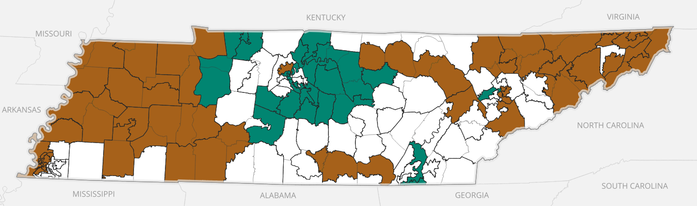
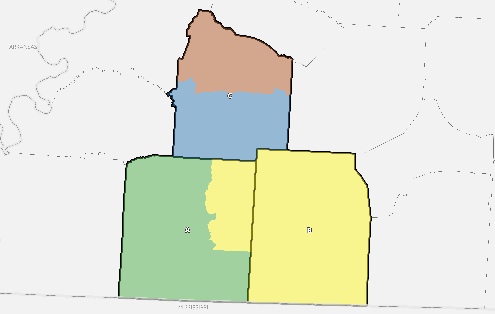
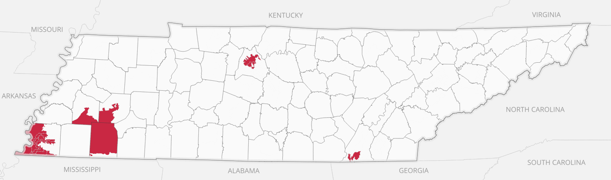
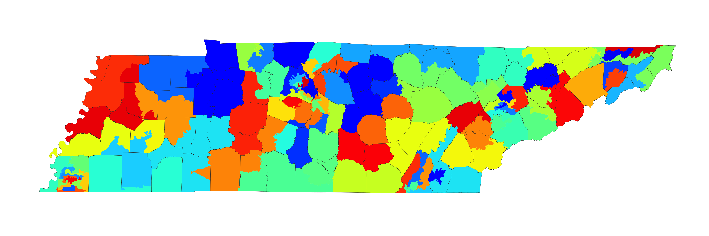
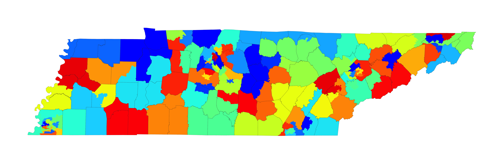

## Introduction

My name is Jonathan Cervas. I am post doctoral fellow at Carnegie Mellon University. 
I have been asked by counsel representing a party to _Moore, et al. v. Lee, et al_ to analyze relevant data and provide my expert opinions relating to the enacted 2022 state House districting plan.

## Qualifications and Publications

My name is Jonathan Cervas and I am a resident of Pittsburgh, Pennsylvania. I am a post-doctoral fellow at Carnegie Mellon University. I teach courses for the Institute of Politics and Strategy, the undergraduate and masters degree granting unit of political science for the univerity; one class is graduate seminar on American politics and one on representation and voting rights. I am also an uncompensated Research Associate of the Electoral Innovation Lab at Princeton University, which is home to the non-partisan Princeton Gerrymandering Project. I received my undergraduate degree at the University of Nevada Las Vegas and my graduate degrees at the University of California Irvine. My 2020 doctoral dissertation is titled “A Quantitative Assessment of the Electoral College, 1790-2020”. As my curriculum vitae, attached as Appendix A, shows, I’ve published ten scholarly articles on topics related to political institutions, elections, and voting rules. My work has been published in journals which specialize in political science, geography, economics, and law. These include the Proceedings of the National Academy of Arts and Sciences, Social Science Quarterly, *Political Geography*, *Public Choice*, *Election Law Journal*, *Stanford Journal of Civil Rights & Civil Liberties*, and *PS: Political Science and Politics*. I have been invited to give talks to Princeton University, University of Houston, and the National Conference of State Legislatures. As part of my service committment to the discipline of political science, I have served as referee for *American Journal of Political Science*, *Political Geography*, *Election Law Journal*, *Public Choice*, and *Political Research Quarterly*.

I have been involved in drawing maps for three federal courts in voting rights and redistricting cases. Three cases involved questions related to the Voting Rights Act and the U.S. Constitution. In *Navajo Nation v. San Juan County, UT*, D.C. No. 2:12-CV-00039-RJS (2018), the district court ruled that the election district for school board and county commission violated the Fourteenth Amendment to the United States Constitution. After the court rejected the county’s remedial map, the court retained Prof. Bernard Grofman as special master. I was employed as assistant to the special master and helped to prepare remedial maps. The court selected the illustrative maps I helped prepare for immediate use in the next election. These maps were upheld by the Tenth Circuit Court of Appeals *Navajo Nation v. San Juan County*, No.18-4005 (10th Cir. 2019). In *Bethune-Hill v. Virginia State Bd. of Elections*, 141 F. Supp. 3d 505 (ED Va. 2015) the federal court ruled that twelve of Virginia’s 100 House of Delegates districts were unconstitutional gerrymanders under precedent set in *Shaw v. Reno* 509 US 630 (1993). Eventually reaching th United States Supreme Court (SCOTUS) the first time, the court remanded *Bethune-Hill v. Virginia State Board of Elections*, 580 U.S. ___ (2017). The district court then ruled eleven of the twelve districts were unconstitutional racial gerrymanders and ordered them redrawn *Bethune-Hill v. Virginia State Bd. of Elections*, 326 F. Supp. 3d 128 (2018). The district court retained Prof. Grofman as special master. I worked with Prof. Grofman as assistant to the special master. Together we created ten map modules; three in Norfolk, two in the peninsula area, three in Petersburg, and two in Richmond. The court selected module combinations that adjusted the boundaries of twenty-five districts. The case was heard for a second time on appeal to SCOTUS, who remanded on standing Virginia House of Delegates v. Bethune-Hill, 587 U.S. ___ (2019). These districts were used in the 2019 election, and because of census delays, again used in 2021. In *Wright v. Sumter County Board of Elections and Registration* (1:14-CV-42 (WLS) U.S. District Court, Middle District of Georgia (2020)), the district court ruled that Sumter County’s voting districts diluted the voting power of Blacks in violation of section 2 of the Voting Rights Act. The court retained Prof. Grofman in his capacity as special master. I again served as assistant to the special master. Working with Prof. Grofman I helped craft four seven-district illustrative plans and one five-district illustrative plan. The court choose one of the plans I helped to prepared. Defendants appealed to the eleventh circuit court, who reviewed the entire record and found the district court did not err in concluding a section 2 violation and that the special master “expressly found an easily achievable remedy available”. *Wright v. Sumter County Board of Elections and Registration*, No. 15-13628 at 45 (11th Cir. 2020). In July of 2021, I entered into contract with the Pennsyvlania Legislative Reapportionment Commission to provide consulting work relating to the creation of the PA state House of Representatives and PA Senate districts to be used during elections held between 2022 and 2030. This work involved numerous aspects of the reapportionment process, not limited to map drawing. T    he maps drafted by the commission passed with a bi-partisan vote on February 4, 2022. My work with the commission is ongoing.

My opinions in this report are based on the knowledge I have accumulated through my education, training, and experience. This training has included a detailed review of the relevant academic literature. My opinions follow additionally from statistical analysis of the following data:

## Data

In order to evaluate the state House plan, I examined:

1) Data delivered by the United States Census on August 12, 2021. This data is referred to as 2020 Census State Redistricting Data (Public Law 94-171), sometimes PL.94-171 and colloquially referred to as PL data. It can be found at https://www2.census.gov/programs-surveys/decennial/2020/data/01-Redistricting_File--PL_94-171/.
- This data includes the total population base used to create districts of approximately equal people, along with several demographic population totals.
2) GIS (Geographic Information Systems) Files
- Official census GIS product from the "Tigerline" program. These files contain the polygons of the nested hierarchical political and geographic subdivisions. I downloaded the 2020 vintage from https://www.census.gov/geographies/mapping-files/time-series/geo/tiger-line-file.html. I post-processed these files to merge with PL population data.
- Tennesee state House district lines, obtained on February 27, 2022 from https://www.capitol.tn.gov/house/committees/Redistricting.aspx. I compared these shapefiles to those found on Dave's Redistricting App (DRA) and find them to match.
- An alternative map proposed by the Democratic caucus, which can be found https://davesredistricting.org/maps#viewmap::706539fb-f439-4d8c-9df8-7a48c6473a30

---

I have been asked by counsel to prepare a report about the Tennessee state House of Representatives apportionment process relating to the splitting of political subdivisions. I was provided research assistance from Charles Murphy, an undergraduate student at Carnegie Mellon University.

## Background and Context

To begin, I will provide some background and the context of which this report is being prepared. 

1) Every ten years, states must engage in reapportioning their state legislative districts to represent changes in population. Districts must satisfy population equality criteria established after court cases beginning with Baker vs. Carr and Reynolds vs. Sims. Generally, courts have ruled that state legislative plans that exceed 10% overall deviation (the largest district and the smallest districts must not differ by more than 10%) or have deviations larger than 5% in either the positive or negative are unconstitutional under the 14th amendment of the US constitution.

2) The lower chamber of the Tennesee General Assembly, the House of Representatives (hereafter refereed to as either "TN House" or just "House"), consists of 99 districts. 

3) After the 2010 census, the total population of Tennesee was 6,346,105. That translate to each district having an "ideal" population of 64,102. To comply with the +/-5% deviation consistent with US Supreme Court mandates, each district must consists of between 60,897 and 67,307 people.

4) The 2020 census showed that Tennessee had a total population of 6,910,840. This represents an increase of 564,735 from the 6,346,105 in the 2010 census. Each of the 99 districts now has an ideal population 69,806. Districts must contain between 66,316 and 73,296 total people.

5) Tennesee's population changed dramatically over the decade. Therefore, the districts for the TN House necessarily also have changed drastically over the decade. For instance, House Districts 34 and 63 grew to be 43% above the ideal population after the new census, and district 80 and 82 ended the decade with 18% fewer people than ideal. The districts for the House necessarily must be changed to order to reflect those population shifts accurately. 

6) _Figure XXXX_ shows the enacted 2012-2020 districts with populations that are malapportioned given the 2020 census population.

---
**_Figure XXXX_ - 2012-2020 TN State House Population Deviations**

_Note: Calculated using 2020 PL 94-171 total population projected into the 2012-2020 state House districts._
---

7) Districts lines must be contiguous -- that one may traverse all parts of the districts without having to exit the district to enter again.

8) There are trillions of potential redistricting plans, and enumerating them all is impossible. Choices in one part of the state are often contingent on choices in other parts of the state.

9) Apportioning 99 districts across the state of Tennessee requires some political subdivisions to be split. Some division splits are necessary based purely on population alone. The legislature then must make other choices about which counties to split in order to achieve districts which have populations as equally as practicable. In the context of state legislative redistricting, these choices include which counties need be split, and, within the allowable deviation of population, how many counties need to be split. Traditional redistricting criteria usually include a limitation of splitting political subdivisions. According to the National Conference of State Legislatures: 

> "The principle of preserving counties and other political subdivisions refers to avoiding division of counties, cities or towns among different districts. While it may be impossible to include only whole jurisdictions within districts and also maintain equal population, states often include the goal of minimizing “splits” for existing political jurisdictions. Unlike some other criteria, preservation of counties and other political subdivisions can be quantified by measuring the number of counties or towns that are split between two or more districts \cite[][p. 77]{NCSL2019}."

10) Tennessee has a total of 95 counties. These counties vary in total population between the smallest county, Pickett County, which has a 2020 population of 5,001, and Shelby County, which has a total 2020 population of 929,744. These differences ensure that Shelby County and other counties with significant populations (greater than 73,296, the upper end of allowable population of a district; but see below for an apparent exception made for Montgomory County) will be divided into more than one district. 18 counties in total require at least one split. (Shelby, Davidson, Knox, Hamilton, Rutherford, Williamson, Montgomery, Sumner, Sullivan, Wilson, Blount, Washington, Bradley, Maury, Madison, Sevier, Putnam, and Anderson). Counties with populations smaller than a single district may be included wholly within districts by combining adjacant counties, but will occassionally require division to ensure equal population in districts.

11) Shelby County is the largest county in Tennessee. The city of Memphis is located in Shelby County. The county has a significant Black population, exceeding 50% of the entire county population. Over 50% of the voting age population is Black. It has a population of 929,744, which is equivalent to 13 complete districts and 32% of a 14th district. If the legislature "maxed out" the population of each district (that is, place a total of 73,296 in each district; though, a court would have to determine if this is a violation of the US Constitution or state law, and given the demographics of Shelby County, was compliant with the VRA), Shelby County could have as few as 12 whole districts and one district that extends beyond its boundaries. If the legislature choose to "seal in" the county, meaning no district extended or split the boundary, it could have 13 *or* 14 total districts. This is indeed what happened in both 2012 and in 2022, that Shelby was sealed and had 13 districts. This choice results in an over-population districts in Shelby County by a total of 22,266 (32% of an entire district). A different but equally justifiable choice could have been made to include 14 whole districts inside the boundaries of Shelby County without splitting the boundary. This choice would have been at least equally defensible as the choice to limit the county to 13 districts since both choices result in no county split. Whether to split a county like Shelby and other large counties even once in order to more faithly comply with a lower allowable population deviation is a matter of law and preference. But, since either choice to create a Shelby County with 13 or 14 districts would necessarily lead to within-district population deviations averaging -4.9% and +2.5%, respectively, and in order to create districts with populations closer to ideal, Shelby County would have 13 districts within its boundaries, and have one district extend beyond the county border exactly one time. 

12) It may or may not be necessary to split particular or specific counties. For example, Blount County has a population that is sufficent for 1.94 districts, within the allowable range for two whole districts with no splits. A legislature might decide to split it once in order to cure a split in another part of the state, or may alternatively choose to create two complete districts without going beyond the border. Even counties like Greene County, which has a population that is only 346 people over ideal for one district, might find themselves split if a legislature's perogatives dictate such a split. For instance, splitting Greene County might be a prudent choice if two other splits can be avoided in other places, especially if this choice is coupled with a compelling community of interest explanation.

---

## House Redistricting Guidelines

The Tennessee constitution additionally provides the following: 

Article II, Section 4: "The apportionment of senators and representatives shall be substantially
according to population."

Article II, Section 5: "Counties having two or more representatives shall be divided into
separate districts. In a district composed of two or more counties, each county shall
adjoin at least one other county of such district; and no county shall be divided in forming
such a district."

_A set of guidelines were issued by the House Redistricting Committee. They include the following instructions_:

House Redistricting Guidelines (https://www.capitol.tn.gov/Archives/House/112GA/redistricting/Documents/House%20Redistricting%20Guidelines%2022.pdf, not dated [Accessed March 6, 2022])

• Each district must be represented by a single member.

• Districts shall comply with the Constitutional requirements for
“one person, one vote”, as judicially interpreted to apply to state
legislative districts.

• Geographic features, boundaries and population figures shall be
based on the 2020 decennial census.

• Districts must be contiguous and contiguity by water is sufficient.

• No more than 30 counties may be split to attach to other counties
or parts of counties to form multi-county districts.

• The redistricting plan will comply with the Voting Rights Act and
the Constitutions of the Tennessee and the United States.

I can find no record of how a maximum of "30 counties" was arrived at for the maximum number of counties that may be split. It may be arbitrary. The TN constitution provides that "no county shall be divided in forming..." a district. There is reference to splitting no more than 30 counties in the majortity opinion in _State Ex Rel. Lockert v. Crowell_ 656 S.W.2d 836 (1983), however, this case was decided based on 1980 apportionment. Since the 1980 census, the Tennessee population is 50% greater, (https://www2.census.gov/prod2/decennial/documents/1980a_tnABC-01.pdf) so the necessity to split counties has likewise been affected by the changing population base and distribution of peoples in TN. The legislature enacted a plan that split exactly the max. In this report, I show that far less than 30 county splits is attainable.

Additionally, though I personally advocate for district populations to be bounded by not more than 5% beyond ideal in the positive or negative directions, the 2022 enacted map has three districts beyond the +5% threshold. I therefore adopt for the purposes of this report the definition that TN seems to use, an overall deviation of not greater than 10%. This might also be referred to as _total population deviation_. See \cite{Cervas2020} for full definition. Note that the 2012-2022 enacted House plan in TN had a smallest district that was -4.76% from ideal, and a largest district at +4.98% from ideal, within the bounds of my perferred definition.

## Counting Political Subdivision Splits

There are two common ways county splits are typically reported. First, the quantity of interest is how many counties have more than one district in them. This might be referred to as "Split Counties". This is a simple measure that asks if a county is divided into to or more districts. A county is said to be split once if there is one line drawn that "splits" the county into twice pieces. 

This leads to the second common measure of splits. The second quantity of interest is how many total splits are found statewide. This measure counts, for each county, the number of districts which are contained in it, minus 1. It therefore counts the number of line segments separating districts inside each county.

These two ways of quantifying splits are commonly found in redistricting software, including in Maptitude for Redistricting and Dave's Redistricting App. 

The state of Tenneesee apparently records a different measure of splits, which is related to these two but distinct. County splits is reported in documents found on the Tenneseee General Assembly website (https://www.capitol.tn.gov/Archives/House/112GA/redistricting/Documents/additional%20december%20evaluations.pdf, not dated, [Accessed March 5, 2022]) that count the number of total counties in which only a partial district is found. It therefore is connected to an adjacent county to receive the rest of the needed population. I will refer to this as "TN County Splits". In the House Redistricting Guidelines document found on the General Assembly website, it instructs that no more than 30 counties can be split in creating a districting plan.

_Figure XXXX_ shows an example of how counting of splits is done. The example shows three counties, "A", "B", and "C", and 4 districts which are not labeled. On the first measure, "Counties Split", there are 2 (A and C); There are 2 "County Splits" in this example (2 in A, 2 in C); finally, there is 1 TN County Split (A). 

---
**_Figure XXXX_ - An Example of How Districts May Split County Lines**

_Note: Districts are unlabeled. Counties are labeled "A", "B", and "C". Though the counties are real, this is just an example of how districts may fit into counties. The data is fictious._
---

### Counties with populations sufficient for one or more whole districts

The following provides a summary of which counties contain populations greater than the size of a single House districts:

1) Two counties have populations sufficent for exactly one district; Greene and Robertson counties. 

2) Six additional counties have populations that exceed the size of one House district but not quite sizable for two district, and thus will need to be split once (Bradley, Maury, Madison, Sevier, Putnam, Anderson). 

3) Washington and Blount counties have populations can allow them to contain two complete House districts. 

4) Sumner, Sullivan, and Wilson counties all may have two full districts and extend a third into another county. 

5) Williamson and Montgomery[^a] counties all have three full House districts and a part of a fourth. 
[^a]: Montgomery County is sealed in the 2022 enacted House map, containing three complete districts, all three of which are the three most over-populated in the state. Residents of Montgomery County are significantly underrepresented in the General Assembly. If this county were to have part of a fourth district, as might be required by law, that would cause at least one addtional "TN County Splits" in the plan, increasing it to 31, which is greater than the max allowed in the House Redistricting Guidelines.

6) Hamilton and Rutherford counties both can fully contain 5 districts each. 

7) Knox County can have 7 whole districts. 

8) Davidson County can have 10 full districts. 

9) Shelby can support either 13 or 14 full districts.

* Unicoi County is only adjacent to Carter if Greene and Washington Counties are "sealed". It can only form a district with part Carter unless Washington County is split (but then Carter County does not need be split).

---

Any county that is large enough to contain a least one district wholly need not be split. That does not imply it *will not* be split, however. But, the total number of splits is necessarily less than the total number of districts (99) by the fact districts have a smaller number of people than that of several whole counties. Of course, some counties will be split in order to achieve population equality. We can calculate the upper bound on the number of counties that need be split[^1].

Let us assume that any county that has a population multiple that is an integer of a district is not split. For Shelby, that is either 13 or 14. Fourty-seven such districts can be draw in Tennessee across 9 counties (Shelby, Davidson, Knox, Hamilton, Rutherford, Blount, Washington, Robertson, Greene). So far, that implies that 47 out of the total 99 districts can be drawn to not cut a single county line (This does not incluce Montgomery County; if included, that implies 50 out of 99 can be drawn without a single "TN County Split") 

If one were to draw the other 52 districts to exactly equal population, n-1 county splits would be necessary. So, to complete a 99 district plan where the nine counties listed above were drawn with the districts full contained within their boundaries, and each other district contained exactly its share of the remaining population, there would be 51 counties cut. This is the maximum conceivable number. In reality, because map-drawers are granted permission to deviate from the ideal population, significant reductions to this number can be made. 

The minimum number of counties that need be split can not be found analytically, but computers can be instructed to develop plans that limit the splitting of counties. Later in this report, I will show that tens of thousands of plans made from combining precincts result in fewer "TN County Splits" than the 2022 enacted House plan.

Measuring plans using these three different notions allow for comparisons any plan equally. _Table 1_ does this for the 2012-2020 enacted map, the 2022-2030 enacted map, and the House Democratic Concept map. The 2022 enacted map scores the worst across all three measures.

In the plan that was enacted in 2012 and used in subseqent elections until 2020, 36 total counties are split into more than one district. These 36 counties were split 70 times in total. 28 counties have districts that have their boundary split. In the 2022 enatced House plan, 38 of the 95 counties are divided into at least two districts, for a total of 74 times, and 30 counties have districts that span the border. By comparison, the conceptual map proposed by the House Democrats cuts only 29 of the 95 counties, and does so by dividing counties only 67 times[^2]. Note that 18 counties exceed the district population and therefore *must* be divided. More restrictive population deviation standards would mean a trade-off that would induce an increasing the number of county splits. The overall deviation, and average absolute deviation are shown for each of the plans in *Table XXXX*.

For the map enacted to be used after the 2022 elections, 2 additional counties were cut, and a total of 4 more cuts, and two additional counties have districts that span their borders compared to the 2012 enacted map. The Democratic House conceptual map splits 9 fewer counties, and does so 7 fewer times. I has 7 fewer counties where a district spans it border to complete a district. 

---
**_Table 1_ - Total County Splits by Plan**

| PLAN | Counties Split | County Splits | TN County Splits | Overall Deviation | Mean Deviation |
| --- | --- | --- | --- | --- | --- |
| 2012 Enacted | 36 | 70 | 28 | 9.7% | 3.4% |
| 2022 Enacted | 38 | 74 | 30 | 9.9% | 3.3% |
| House Democratic Concept | 29 | 67 | 23 | 9.7% | 2.2% |

_Note: "Counties Split" is the total number of counties that has at least two districts in it. "county Splits" is the total number of pieces in counties. "TN County Splits" is the number of counties that the county line needed to be crossed to form a complete district with an adjacent county._
---

## Majority-Minority Districts and the VRA

Tennesee has a total Black voting age population (BVAP) exceeding 16%. The map used from 2012-2020 also had 13 Black-majority districts, ranging from 55.1% to 75.5% BVAP. The 2022 enacted House map creates 13 Black-majority districts, with BVAP in those districts ranging from 54% to 81.7% Black. The House Democratic Concept maps creates 13 Black-majority districts as well, but additionally creates a 14th district with a BVAP of 47.3% (the next highest in the enacted plan is 32.1%). No other single race or ethnicity minority group constitutes a geographically compact and sizeable population in which a Voting Rights Act district would be required, in my opinion. Given the history of bloc voting in Tennesee, and the geographic concentration of Black populations in Tenneesee, at least 13 districts which enable Blacks the opportunity to elect their candidates of choice must be drawn.

---
**_Figure XXXX_ - 2012-2020 TN State House Majority-Black Voting Age Districts**

_Note: Calculated using 2020 PL 94-171 Black alone voting age population._
---

_Figure XXXX_ shows the location of the 13 majority-Black districts in the 2022 enacted plan. They are concentrated in Shelby County (9 out of 13). Davidson county has two black-majority districts, one is located in Hamilton County, and one (HD80) spans Hardeman, Madison, and Haywood counties. 

A majority-Black district is found in the same general area in the House Democratic concept map. One major difference between these two plans, however, is that House District 80 actually creates three county splits in the enacted 2022 plan, but only creates one county split in the Democratic conceptual alternative. Haywood and Hardeman are combined and kept unsplit within this district, while incorporating a piece of Madison County; in the 2022 enacted plan, all three counties are split. None of the three counties contain a single district, and all three counties are cut by this district. 

In the 2012-2020 enacted plan, House District 80 largely appeared as it does in the 2022 map, however, in the 2012 map, it only contained pieces of Madison and Hardeman counties. After the 2020 census, the population of the 2012 HD80 district was significantly under the 2020 ideal population and needed to add territory. To do so, the legislature added part of Haywood County. But, in doing so, and before making either Madison or Hardeman County unsplit, they added a part of Haywood that increased the Black voting age population 3.1%, up to 57.47%. This calls into question the motivations involving this decision. The part of Hardeman County not placed in HD80 has 2,679 people, and if added to HD80, would make that district just 472 short of ideal. It would maintain a BVAP of 55.76%. However, it would dis-connect two pieces of Fayette and McNairy counties, so other changes would be required.

_It is my conclusion that since alternative plans that require fewer counties splits exist, the VRA and its requirements are not a compelling state interest to justify the three-county split found in HD80._

## Ensembles

Computer assistence in drawing redistricting plans has greatly enhanced the efficiency of finding alterative options. to further investigate the question about whether the 2022 enacted plan, consistent with the TN constitution that prohibits the division of counties except for the purpose of creating legal plans, limits the number of counties which have districts that span their borders. 

I employ a Markov chain Monte Carlo algorithm that generates random plans. 

I instructed the computer to perfer plans that reduce the number of county splits. 

I ensure that each of the generated plans maintains the overall deviation of under 10%. 

Each plan is build from aggregating contiguous precincts, and the resulting maps are contiguous. 

The plans I generated are of similar compactness to the enacted plan. 

I constrained the algorithm to ensure that each plan had a minimum of 13 Black-majority districts. 

I used no partisan data in forming plans.

My usage of this algorithm is not for the purpose of making statistical claims nor do I generate a represenative sample of all plans. Rather, my use of the algorithm was to generate legally compliant alternatives to the enacted map that are more faithful to the spliting provisions found in the Tennesee constitution.

I have created over 90,000 plans that split, according to the TN County Split metric, at least 6 fewer counties. Of these, 86,215 split 7 fewer counties. _Table 2_ provides a summary of the plans generated by the ensemble. I also included the relevent data for the 2022 enacted House plan.

---
**_Table 2_ - Total County Splits by Plan**

| Number of Plans | TN County Splits | Counties Split | County Splits | Polsby-Popper Compactness | Overall Deviation | Mean Deviation |
| --- | --- | --- | --- | --- | --- | --- |
| 2022 enacted | 30 | 38 | 74 | 0.233 | 9.9% | 3.28% |
| 3,791 | 24 | 29 | 68 | 0.247 | 9.9% | 2.66% |
| 86,215 | 23 | 28 | 67 | 0.254 | 9.9% | 2.69% |

---

The plans generated by the ensemble are created using a base precinct geography file. The average population of a precinct is 3,517 persons, ranging from 0 to 18,830. The median precinct has 2,857 persons. The several very large precincts such as the largest limit the potential for some plans to be generated, biasing the creating of plans with more splits. This potentially indicates that even fewer "TN County Splits" could be generated if aggregating geographies with smaller amounts of people, such as census blocks (mean=39) or block groups (mean=1,515).

_The plans found in the ensemble have very low numbers of county splits, but fewer splits might be possible._

## Plans

I will qualitatively and quantitatively evaluate plans in the section below. These include the 2022-2030 enacted plan, the House Democratic Concept map, and several random plans generated by the algorithm. 

I have randomly selected plans from the ensemble at various stages of the monte carlo chain. These plans are "3_0_478", "3_1_2400", "3_1_7500", "3_2_13700", "3_4_5500", and "3_5_10428". There is nothing distinct about these plans compared to the 90,000 other plans I have generated. These plans all have a low number of splits because I started with a "seed" plan that already was quite low, and instructed the computer to find plans that did even better. There are potentially hundreds of thousands, or even millions or billions of plans that could have been created that split 25 counties, 26 counties, 27 counties, eceteria.
[]: Seed Plan: https://davesredistricting.org/join/cdf58ec5-7701-4043-a8aa-90c5c72fa6cc
[]: 3_0_478: https://davesredistricting.org/join/d2097953-22d1-441e-8b5f-86ae9c8bfc2e
[]: 3_1_2400: https://davesredistricting.org/join/e9e175e1-bd53-4699-9b02-39528b78fffa
[]: 3_1_7500: https://davesredistricting.org/join/107c5a27-6309-4bdd-a005-8192ad18c6b4
[]: 3_2_13700: https://davesredistricting.org/join/ae09519e-87c4-4903-8a81-7c3f60a31f14
[]: 3_4_5500: https://davesredistricting.org/join/4f5314e7-97e6-4bb7-8474-e5f51d817429
[]: 3_5_10428: https://davesredistricting.org/join/b42ed303-0fb6-4669-9d82-f9440e50f7ac

---
**_Table 3_ - Plan Comparisons**

|          **Plan**          | **TN County Splits** | **Counties Split** | **County Splits** | **Overall Deviation** | **Average Deviation** | **Majority-Minority Districts** | **Polsby-Popper** |
|:--------------------------:|:--------------------:|:------------------:|:-----------------:|:---------------------:|:---------------------:|:-------------------------------:|:-------------:|
|       _2012 Enacted_       |          28          |         36         |         70        |         9.74%         |         3.39%         |                13               |     0.234     |
|       _2022 Enacted_       |          30          |         38         |         74        |          9.9%         |         3.28%         |                13               |     0.233     |
| _House Democratic Concept_ |          23          |         29         |         67        |         9.72%         |         2.17%         |                13               |     0.279     |
|          _3_0_478_         |          23          |         28         |         67        |         9.82%         |         2.55%         |                13               |     0.253     |
|         _3_1_2400_         |          24          |         29         |         68        |          9.9%         |         2.75%         |                13               |     0.257     |
|         _3_1_7500_         |          23          |         28         |         67        |         9.94%         |         2.76%         |                13               |     0.250     |
|         _3_2_13700_        |          23          |         28         |         67        |         9.99%         |         2.89%         |                13               |     0.260     |
|         _3_4_5500_         |          23          |         28         |         67        |         9.99%         |         2.74%         |                13               |     0.242     |
|         _3_5_10428_        |          23          |         28         |         67        |         9.98%         |         2.63%         |                13               |     0.254     |

_Note: Polsby-Popper scores is a widely accepted measure of district compactness. There are other measures that attest to different aspects of a district's geographic characteristics, but here I use Polsby-Popper just to ensure roughly comparable compactness levels in the plans generated by the ensemble. Highers scores are better._
---

#### 2022 Enacted Plan

The plan that was enacted by the General Assembly (2022 enacted plan) for use between 2022 and 2030 has an overall deviation of 9.91%. Districts vary in population between the smallest, House District 78, which has a total population of 66,445 (-4.82%), and the two with the largest populations, House District 67 and 68, both of which have a total population of 73,358 (+5.09%). 

Thirteen districts are kept completely contained in Shelby County. The county is split 12 times into 13 pieces, but the county border itself is not split. Davidson County contains 10 districts fully inside the county boundaries, but the county line itself is unsplit. Knox County contains 7 districts fully within the county boundary, and the county border itself is not split. Hamilton contains exactly 5 districts and the county boundary is not cut. Rutherford County wholly contains 5 districts, with the county border not crossed. It appears that the drafters of the map intended to "seal in" these more urban counties in a way to avoid the splitting of their borders. One consequence of this choice is that there is a shortage in population of over 40,000 people that need to be obsorbed by the remaining 59 districts not included in these 40, which may actually *increase* to total number of counties that need to be split. Moreover, restricting Shelby County to just 13 districts, instead of the potential 14 districts, almost certainly leads to one additional split at some place in the statewide map; this is because there will only be 85 instead of 86 remaining districts.

---
**_Figure XXXX_ - 2022 Enacted Plan**

---

#### House Democratic Concept Map 12/15/2021

An alternative map was proposed by the House Democrats on December 15, 2021. The map has an overall deviation of 9.72%. Concept District 7 has the smallest population of 66,495 (-4.74%). Concept District 27 has the largest population of 73,280 (+4.98%). Thirteen districts are wholly contained in Shelby County, and one district (94) also contains all of Fayette County. This means that Shelby County is split on the county border, but the average deviation of districts in Shelby County are lower. Like the 2022 enacted map, the alternative proposed by the House Democrats creates 10 districts in Davidson County, with no county split. Likewise, Know County contains 7 districts with no county split, Hamilton contains 5 districts with no county split, and Rutherford contains 5 counties with no split.

---
**_Figure XXXX_ - House Democratic Concept Map**

---

_Note, for the plans generated by the ensemble, the district numbers do not align closely with plans drafted by hand._

#### Ensemble Plan 3_0_478

This plan has a largest district that contains a population of 73,034 (+4.62%). The smallest district has 66,181 (-5.19%) people. The overall deviation is 9.82%. Shelby County contains 13 full disricts, and part of a 14th that extends into Fayette County. Davidson County has ten districts fully inside the county border. Knox County has 7 districts, none of which extend beyond the county border. Montgomery County has three full districts, and a 4th district that extends to get population by taking all of Cheatham County and parts of Dickson County.

---
**_Figure XXXX_ - Ensemble Plan 3_0_47**

---

#### Ensemble Plan 3_1_2400

The largest district in this plan has 73,034 (+4.62%) and the smallest district has 66,119 (-5.28%). The overall deviation is 9.9%.  Shelby County has 13 full districts, and a 14th that extends to take all of Fayette County. Davidson County contains 10 districts with no districts going beyond its boundary. Knox County contains 7 districts within its boundaries. Montgomery County has two full districts and a third that is made up of all of Cheatham and parts of Dickson County.

---
**_Figure XXXX_ - Ensemble Plan 3_1_2400**

---

#### Ensemble Plan 3_1_7500

Districts range in population from 66,093 (-5.32%) to 73,034 (+4.62%) and have an overall range of 9.94%. Shelby County contains 13 full districts, with parts of a 14th that form a district by combining Fayette County. Davidson County contains 10 full districts. Knox County contains 7 full districts. Montgomery contains 3 full districts, with a 4th district combining parts of Dickson and all of Cheatham County.

---
**_Figure XXXX_ - Ensemble Plan 3_1_7500**

---

#### Ensemble Plan 3_2_13700

This plan has a smallest district of 66,127 (-5.27%) and a largest district of 73,101 (+4.72%). The overall deviation is 9.99%. Shelby County contains 13 full districts, with a 14th district created by combining parts with Fayette County. Davidson County contains 10 full districts. Knox County contains 7 full districts. Montgomery County contains two full districts, with a third district finding population in Cheatham and parts of Dickson County.

---
**_Figure XXXX_ - Ensemble Plan 3_2_13700**

---

#### Ensemble Plan 3_4_5500

This plan has a smallest district population of 66,368 (-4.93%) and a largest population district with 73,339 (+5.06%). The overall deviation is 9.99%. Shelby County contains 13 full districts, with a 14th district that incorporates all of Fayette County. Davidson County contains 10 full districts. Knox County has 7 full districts. Montgomery County has three full districts, with a fourth district that takes all of Cheatham and parts of Dickson.

---
**_Figure XXXX_ - Ensemble Plan 3_4_5500**

---

#### Ensemble Plan 3_5_10428

This plan has district populations that range between 66,400 (-4.88%) and 73, 366 (+5.1%). The overall deviation is 9.98%. Like the other plans in the ensemble, Shelby County contains 13 full districts, and a 14th district is formed by combining a segment with Fayette County. Davidson has 10 full districts. Knox County has 7 full districts. Mongomery County has three full districts, and the remaining parts include all of Cheatham and parts of Dickson County. 

---
**_Figure XXXX_ - Ensemble Plan 3_5_10428**

---

# Conclusion

Counsel has asked me to prepare this report anaylzing the enacted 2022-2030 state House redistricting plan. Counsel was interested in my opinion about whether the enacted plan had the effect of limiting the number of counties affected by having districts cross over the county boundary. I have referred to this type of split throughout this report at "TN county splits". The enacted plan has 30 such splits. Using computer algorithm methods, I was very easily able to create over 90,000 plans that were superior to the enacted plan on this metric. Moreover, the plans I generated were as compact as the enacted plan, had a similar overall deviation, actually had a reduction in the population deviation per district, on average, and reduced the total number of counties that had any split, along with the total number of splits found in the plan, regardless of how one counts such things.

It is my opinion that legally valid plans for the state House of Represenatives in Tennesee can have fewer than 30 "TN county splits". Moreover, there are millions, and perhaps billions of plans available to the legislature that more faithfully comply with the Tennessee constitutional provision prohibiting the splitting of counties.

[^1]: Sealing in a county could have a negative effect on the number of split counties. For instance, imagine a county is sealed in but in doing so a total of 20,000 extra people are placed in districts in that county. If an adjacent county has a population that is the ideal minus 20,000, it will now have to split an adjacent county to get the population it could have otherwise had from the first county. Like the butterfly effect, it could ripple through the plan. Additionally, if sealing in a county prohibits a more efficent split for another county, it could have the effect of increasing the total county splits in a plan. Moreover, as with Unicoi, the effect of sealing Washington County is that is _guarentees_ that Carter County is split, even though its population is small enough to not be split.

[^2]: Plan comparison documents found on the General Assembly website (https://www.capitol.tn.gov/Archives/House/112GA/redistricting/Documents/additional%20december%20evaluations.pdf) list county splits as 30 for the 2022 enacted plan, and 23 for the House Democratic concept map. I do not know how these measures are calculated, nor are they reported in either Maptitude for Redistricting (which I have a license) or Dave's Redistricting App. One potential explanation of this measure of splitting is the number of districts that crosses into multiple counties. This is a non-standard way of defining county splits and if applied as a legal standard might lead to a situation where larger counties are needlessly penalized since there is more descretion as to whether it needs to be split. (see discussion above about Shelby County)

