<!-- 
---
title: "Demonstrative maps for the Tennessee State House of Representatives Relating to Political Subdivisions Splits"
runningheader: "Tennessee State House Political Subdivisions Splits" # only for pdf output
subtitle: "" # only for html output
author: "Jonathan Cervas"
date: "`r format(Sys.time(), '%B %d, %Y')`"
output:
  tufte::tufte_html: default
  tufte::tufte_handout:
    citation_package: natbib
    latex_engine: xelatex
  tufte::tufte_book:
    citation_package: natbib
    latex_engine: xelatex
bibliography: /Users/user/Downloads/library.bib
link-citations: yes
---
 -->

## Introduction

Counsel has asked me to prepare a report after creating demonstrative plans adhering to the following criteria:

1. Shelby County should have exactly 13 or 14 house districts.  No portion of Shelby County should be combined with any adjacent county in creating a district.

2. 13 majority-minority districts, as created in the redistricting plan enacted by the Tennessee legislature, should be preserved in the maps.

3. Davidson, Hamilton, and Knox Counties, like Shelby County, should not have any portions of the county combined with any adjacent counties in creating a district.

In addition to the four counties listed above, Rutherford County has 5 districts where none are combined with any adjacent county. My maps will do the same.

Plaintiffs ask that I create these maps with a goal creating as few county-dividing districts as possible maintaining a maximum overall population deviation of 9.9% or less.

Plaintiffs asked that I create demonstrative maps to be appended to this expert report as examples of maps that meet the three enumerated goals stated above but that also have fewer than 30 county-dividing districts and lower than a 9.9% total population deviation.

I have enlisted the help of Charles Murphy, an undergraduate mathematics major at Carnegie Mellon University who has experience working with "GerryChain", a computational algorithm used for generating redistricting plans. I have also enlisted the assistance of Zach Griggy, an undergraduate political science major at the Univeristy of California Irvine who has assisted Bernard Grofman on various special master jobs for state courts drawing Congressional districting plans.


## Qualifications and Publications

My name is Jonathan Cervas and I am a resident of Pittsburgh, Pennsylvania. I am a post-doctoral fellow at Carnegie Mellon University. I teach courses for the Institute of Politics and Strategy, the undergraduate and master’s degree granting unit of political science for the university; one class is a graduate seminar on American politics and one on representation and voting rights. I am also an uncompensated Research Associate of the Electoral Innovation Lab at Princeton University, which is home to the non-partisan Princeton Gerrymandering Project. I received my undergraduate degree at the University of Nevada Las Vegas and my graduate degrees at the University of California Irvine. My 2020 doctoral dissertation is titled “A Quantitative Assessment of the Electoral College, 1790-2020”. As my curriculum vitae, attached as Appendix A, shows, I’ve published eleven peer-reviewed scholarly articles on topics related to political institutions, elections, redistricting, and voting rules. My work has been published in journals which specialize in political science, geography, economics, and law. These include the *Proceedings of the National Academy of Arts and Sciences*, *Social Science Quarterly*, *Political Geography*, *Public Choice*, *Election Law Journal*, *Stanford Journal of Civil Rights & Civil Liberties*, *Presidential Studies Quarterly*, and *PS: Political Science and Politics*. I have been invited to give talks to Princeton University, University of Houston, and the National Conference of State Legislatures. As part of my service commitment to the discipline of political science, I have served as referee for *American Journal of Political Science*, *Political Geography*, *Election Law Journal*, *Public Choice*, and *Political Research Quarterly*.

I have been involved in drawing maps for three federal courts in voting rights and redistricting cases. Three cases involved questions related to the Voting Rights Act and the U.S. Constitution. In *Navajo Nation v. San Juan County, UT*, D.C. No. 2:12-CV-00039-RJS (2018), the district court ruled that the election districts for school board and county commission violated the Fourteenth Amendment to the United States Constitution. After the court rejected the county’s remedial map, the court retained Prof. Bernard Grofman as special master. I was employed as assistant to the special master and helped to prepare remedial maps. The court selected the illustrative maps I helped prepare for immediate use in the next election. These maps were upheld by the Tenth Circuit Court of Appeals *Navajo Nation v. San Juan County*, No.18-4005 (10th Cir. 2019). In *Bethune-Hill v. Virginia State Bd. of Elections*, 141 F. Supp. 3d 505 (ED Va. 2015) the federal court ruled that twelve of Virginia’s 100 House of Delegates districts were unconstitutional gerrymanders under precedent set in *Shaw v. Reno* 509 US 630 (1993). Eventually reaching the United States Supreme Court (SCOTUS) the first time, the court remanded *Bethune-Hill v. Virginia State Board of Elections*, 580 U.S. ___ (2017). The district court then ruled eleven of the twelve districts were unconstitutional racial gerrymanders and ordered them redrawn. *Bethune-Hill v. Virginia State Bd. of Elections*, 326 F. Supp. 3d 128 (2018). The district court retained Prof. Grofman as special master. I worked with Prof. Grofman as assistant to the special master. Together we created ten map modules; three in Norfolk, two in the peninsula area, three in Petersburg, and two in Richmond. The court selected module combinations that adjusted the boundaries of twenty-five districts. The case was heard for a second time on appeal to SCOTUS, who remanded on standing. Virginia House of Delegates v. Bethune-Hill, 587 U.S. ___ (2019). These districts were used in the 2019 election, and because of census delays, again used in 2021. In *Wright v. Sumter County Board of Elections and Registration* (1:14-CV-42 (WLS) U.S. District Court, Middle District of Georgia (2020)), the district court ruled that Sumter County’s voting districts diluted the voting power of Blacks in violation of section 2 of the Voting Rights Act. The court retained Prof. Grofman in his capacity as special master. I again served as assistant to the special master. Working with Prof. Grofman I helped craft four seven-district illustrative plans and one five-district illustrative plan. The court choose one of the plans I helped to prepare. Defendants appealed to the eleventh circuit court, who reviewed the entire record and found the district court did not err in concluding a section 2 violation and that the special master “expressly found an easily achievable remedy available”. *Wright v. Sumter County Board of Elections and Registration*, No. 15-13628 at 45 (11th Cir. 2020). In July of 2021, I entered into contract with the Pennsyvlania Legislative Reapportionment Commission to provide consulting work relating to the creation of the PA state House of Representatives and PA Senate districts to be used during elections held between 2022 and 2030. This work involved numerous aspects of the reapportionment process, not limited to map drawing. The maps drafted by the commission passed with a bi-partisan vote on February 4, 2022. The Pennsylvania Supreme Court unimously affirmed the final reapportionment plan. My work with the commission is ongoing.

My opinions in this report are based on the knowledge I have accumulated through my education, training, and experience. This training has included a detailed review of the relevant academic literature. My opinions follow additionally from statistical analysis of the following data:


## Data

In order to evaluate the state House plan, I examined:

1) Data delivered by the United States Census on August 12, 2021. This data is referred to as 2020 Census State Redistricting Data (Public Law 94-171), sometimes PL.94-171 and colloquially referred to as PL data. It can be found at [https://www2.census.gov/programs-surveys/decennial/2020/data/01-Redistricting_File--PL_94-171/](https://www2.census.gov/programs-surveys/decennial/2020/data/01-Redistricting_File--PL_94-171/).
- This data includes the total population base used to create districts of approximately equal people, along with several demographic population totals.
2) GIS (Geographic Information Systems) Files
- Official census GIS product from the "Tigerline" program. These files contain the polygons of the nested hierarchical political and geographic subdivisions. I downloaded the 2020 vintage from [https://www.census.gov/geographies/mapping-files/time-series/geo/tiger-line-file.html](https://www.census.gov/geographies/mapping-files/time-series/geo/tiger-line-file.html). I post-processed these files to merge with PL population data.
- Tennesee state House district lines, obtained on February 27, 2022 from [https://www.capitol.tn.gov/house/committees/Redistricting.aspx](https://www.capitol.tn.gov/house/committees/Redistricting.aspx). I compared these shapefiles to those found on Dave's Redistricting App (DRA) and find them to match.
- An alternative map proposed by the Democratic caucus, which can be found [https://davesredistricting.org/maps#viewmap::706539fb-f439-4d8c-9df8-7a48c6473a30](https://davesredistricting.org/maps#viewmap::706539fb-f439-4d8c-9df8-7a48c6473a30)


## Urban Counties

The five counties listed below have districts completely "embedded" in them. The rest of the state can be drawn independently of these counties. Below is a summary of the 5 counties which will be treated as they were enacted in the 2022 House map:

- Shelby County with exactly 13 (for illustrative purposes, I also treated Shelby County as having contained 14 districts)

- Davidson County with exactly 10 districts

- Knox County has exactly 7 districts

- Hamilton County has exactly 5 districts

- Rutherford County has exactly 5 districts


```{r, echo=F, message=FALSE, warning=FALSE, include=FALSE, eval=FALSE}
# TN_geo.blocks <- rgdal::readOGR("/Users/user/Google Drive/GitHub/Data Files/GIS/Tigerline/2020/blocks/47/tl_2020_47_tabblock20.shp")
# 	TN_geo.blocks.tmp <- TN_geo.blocks
# TN_pop.blocks <- read.csv("/Users/user/Google Drive/GitHub/Data Files/Census/TN2020.pl/clean data/TN_blocks.csv")
# 	TN_pop.blocks$GEOCODE <- as.character(TN_pop.blocks$GEOCODE)
# TN_geo.blocks.tmp@data <- dplyr::full_join(TN_geo.blocks.tmp@data, TN_pop.blocks, by= c("GEOID20"="GEOCODE"))
# tn_enacted_block <- read.csv("/Users/user/Google Drive/Projects/Redistricting/2022/TN/Plans/2022 Enacted/TN 2022 House Enacted-block-assignments.csv")
source("https://raw.githubusercontent.com/jcervas/R-Functions/main/GERRYfunctions.R")

TN_pop.counties <- read.csv("/Users/user/Google Drive/GitHub/Data Files/Census/TN2020.pl/clean data/TN_county.csv")
tn.pop <- sum(TN_pop.counties$TOTAL)
ideal.house <- tn.pop/99

4078548/ideal.house

929744/ideal.house
715884/ideal.house
478971/ideal.house
366207/ideal.house
341486/ideal.house
tn.pop - (929744+715884+478971+366207+341486)
4078548/ideal.house

deviation <- 0.0143375

freeze.dist <- 
	c(
		"Shelby County",
		"Davidson County",
		"Rutherford County",
		"Hamilton County",
		"Knox County"
		)
plans <- c("apple_seed", "orange_seed")
exc.cnty <- TN_pop.counties$GEOCODE[TN_pop.counties$NAME %in% freeze.dist]
TN.vtd <- rgdal::readOGR("/Users/user/Google Drive/GitHub/Data Files/Census/TN2020.pl/GIS/vtd/TN_vtd20.shp")
	TN.vtd <- TN.vtd[!paste0("47", TN.vtd@data$COUNT) %in% exc.cnty, ]
# rgdal::writeOGR(TN.vtd, "/Users/user/Library/Mobile Documents/com~apple~CloudDocs/Downloads/", layer= "short-TN-vtd", driver="ESRI Shapefile", overwrite_layer=T)
png(paste0("/Users/user/Library/Mobile Documents/com~apple~CloudDocs/Downloads/TN-short-vtd.png"), 
	height = 2000, width = 6000, 
	units = "px", pointsize = 24)
	sp::plot(TN.vtd, col="#c41230", density=10, lwd=5)
	sp::plot(TN_geo.counties.tmp, border="gray20", lwd=1, add=T)
dev.off()

apple_seed <- read.csv("/Users/user/Google Drive/Projects/Redistricting/2022/TN/Plans/Apple Seed/short - apple-seed-precinct-assignments.csv", colClasses=c("character"))
orange_seed <- read.csv("/Users/user/Google Drive/Projects/Redistricting/2022/TN/Plans/Orange Seed/short - orange-seed - precinct-assignments.csv", colClasses=c("character"))

plans.tmp <- orange_seed
```


*[Table 1](#tab-1)* shows the population of the 5 urban counties that are not changed from the plan that was enacted.


### Table 1 - Counties which are not split {#tab-1}

| County | Population | Ideal Districts | Districts in enacted |
|:---:|:---:|:---:|:---:|
| Shelby County | 929,744 | 13.32 | 13 |
| Davidson County | 715,884 | 10.26 | 10 |
| Knox County | 478,971 | 6.86 | 7 |
| Hamilton County | 366,207 | 5.25 | 5 |
| Rutherford County | 341,486 | 4.89 | 5 |
|---|---|---|---|
| *Total* | *2,832,292* | *40.47* | *40* |
| *90 other counties* | *4,078,548* | *58.43* | *58* |
_Note: 2020 Census total population. The ideal size of one House district is 69,806. These five counties have a total population of 2,832,292. Taken together, they ideally contain 40.57 seats out of 99 (40.1%) total seats. In the enacted plan, they only have 40 total districts. Tennessee's total state population is 6,910,840._


### Figure 1 - Map of Tennessee precincts that will be evaluted {#fig-vtd}


*Note: Only the non-urban counties will undergo changes to districts from what was enacted in the 2022 House map.*

## Counting Political Subdivision Splits

There are two common ways county splits are typically reported. First, the quantity of interest is how many counties have more than one district in them. This might be referred to as "Split Counties". This is a simple measure that asks a logical TRUE/FALSE statement if a county is divided into two or more districts. A county is said to be split once if there is one line drawn that "splits" the county into two pieces. The number of counties that are TRUE are summed. The maximum is the total number of counties in the jurisdiction. 

This leads to the second common measure of splits. The second quantity of interest is how many total splits are found statewide. This measure counts, for each county, the number of districts which are contained in it, minus 1. It therefore counts the number of line segments separating districts inside each county.

These two ways of quantifying splits are commonly found in redistricting software, including in Maptitude for Redistricting and Dave's Redistricting App. 

The state of Tennessee records a different measure of splits, which is related to these two but distinct. County splits is reported in documents found on the Tennessee General Assembly website ([https://www.capitol.tn.gov/Archives/House/112GA/redistricting/Documents/additional%20december%20evaluations.pdf](https://www.capitol.tn.gov/Archives/House/112GA/redistricting/Documents/additional%20december%20evaluations.pdf), not dated, [Accessed March 5, 2022]) that count the number of total counties in which only a partial district is found. It therefore is connected to an adjacent county to receive the rest of the needed population. I will refer to this as "TN County Splits". In the House Redistricting Guidelines document found on the General Assembly website, it instructs that no more than 30 counties can be split in creating a districting plan.


### Counties with populations sufficient for one or more whole districts

The following provides a summary of which counties contain populations greater than the size of a single House district:

1) Two counties have populations sufficient for exactly one district; Greene and Robertson counties. 

2) Six additional counties have populations that exceed the size of one House district but not quite sizable for two districts, and thus will need to be split once (Bradley, Maury, Madison, Sevier, Putnam, Anderson). 

3) Washington and Blount counties have populations that can allow them to contain two complete House districts. 

4) Sumner, Sullivan, and Wilson counties all may have two full districts and extend a third into another county. 

5) Williamson and Montgomery[^1] counties all have three full House districts and a part of a fourth. 

6) Hamilton and Rutherford counties both can fully contain 5 districts each. 

7) Knox County can have 7 whole districts. 

8) Davidson County can have 10 full districts. 

9) Shelby can support either 13 or 14 full districts.

* Unicoi County is only adjacent to Carter County if Greene and Washington Counties are "sealed". It can only form a district with part Carter unless Washington County is split (but then Carter County does not need to be split).


Any county that is large enough to contain a least one district wholly need not be split. That does not imply it *will not* be split, however. But, the total number of splits is necessarily less than the total number of districts (99) by the fact districts have a smaller number of people than that of several whole counties. Of course, some counties will be split in order to achieve population equality. We can calculate the upper bound on the number of counties that need to be split[^2].

Let us assume that any county that has a population multiple that is an integer of a district is not split. For Shelby, that is either 13 or 14. Forty-seven such districts can be drawn in Tennessee across 9 counties (Shelby, Davidson, Knox, Hamilton, Rutherford, Blount, Washington, Robertson, Greene). So far, that implies that 47 out of the total 99 districts can be drawn to not cut a single county line (This does not include Montgomery County; if included, that implies 50 out of 99 can be drawn without a single "TN County Split") 

If one were to draw the other 52 districts to exactly equal population, n-1 county splits would be necessary. So, to complete a 99-district plan where the nine counties listed above were drawn with the districts fully contained within their boundaries, and each other district containing exactly its share of the remaining population, there would be 51 counties cut. This is the maximum conceivable number. In reality, because map-drawers are granted permission to deviate from the ideal population, significant reductions to this number can be made. 

The minimum number of counties that need to be split cannot be found analytically, but computers can be instructed to develop plans that limit the splitting of counties. Later in this report, I will show that tens of thousands of plans made from combining precincts result in fewer "TN County Splits" than the 2022 enacted House plan.

Measuring plans using these three different variations of county split counts allows for comparisons of any plan. *[Table 2](#tab-2)* does this for the 2012-2020 enacted map, the 2022-2030 enacted map, and the House Democratic Concept map. The 2022 enacted map scores the worst across all three measures.


### Table 2 - Total County Splits by Plan {#tab-2}

| PLAN | Counties Split | County Splits | TN County Splits | Overall Deviation | Mean Deviation |
|:---:|:---:|:---:|:---:|:---:|:---:|
| 2012 Enacted | 36 | 70 | 28 | 9.7% | 3.4% |
| 2022 Enacted | 38 | 74 | 30 | 9.9% | 3.3% |
| House Democratic Concept | 29 | 67 | 23 | 9.7% | 2.2% |
_Note: "Counties Split" is the total number of counties that have at least two districts in it. "County Splits" is the total number of pieces in counties. "TN County Splits" is the number of counties that the county line needed to be crossed to form a complete district with an adjacent county._


In the plan that was enacted in 2012 and used in subsequent elections until 2020, 36 total counties are split into more than one district. These 36 counties were split a total of 70 times, and 28 counties have districts that span their border. In the 2022 enacted House plan, 38 of the 95 counties are divided into at least two districts, for a total of 74 times, and 30 counties have districts that span the border. By comparison, the House Democratic Conceptual Map cuts only 29 of the 95 counties, and does so by dividing counties only 67 times, and 23 counties have districts that span the border[^3]. Note that 18 counties exceed the district population and therefore *must* be divided. More restrictive population deviation standards would require a trade-off that would in effect increase the number of county splits. The overall deviation and average absolute deviation are shown for each of the plans in *[Table 2](#tab-2)*.

For the map enacted to be used beginning with the 2022 elections, 2 additional counties were cut, and a total of 4 more cuts, and 2 additional counties have districts that span their borders compared to the 2012 enacted map. The Democratic House conceptual map splits 9 fewer counties, and does so 7 fewer times than the plan enacted in 2022. Moreover, it has 7 fewer counties where a district spans it border to complete a district ("TN County Splits"). 


#### 2022 Enacted Plan

The plan that was enacted by the General Assembly (2022 enacted plan) for use between 2022 and 2030 has an overall deviation of 9.91%. Districts vary in population between the smallest, House District 78, which has a total population of 66,445 (-4.82%), and the two with the largest populations, House District 67 and 68, both of which have a total population of 73,358 (+5.09%). 

Thirteen districts are kept completely contained in Shelby County. The county is split 12 times into 13 pieces, but the county border itself is not split. Davidson County contains 10 districts fully inside the county boundaries, but the county line itself is unsplit. Knox County contains 7 districts fully within the county boundary, and the county border itself is not split. Hamilton contains exactly 5 districts and the county boundary is not cut. Rutherford County wholly contains 5 districts, with the county border not crossed. It appears that the drafters of the map intended to "seal in" these more urban counties in a way to avoid the splitting of their borders. One consequence of this choice is that there is a shortage in population of over 40,000 people that need to be absorbed by the remaining 59 districts not included in these 40, which may actually *increase* the total number of counties that need to be split. Moreover, restricting Shelby County to just 13 districts, instead of the potential 14 districts, almost certainly leads to one additional split at some place in the statewide map; this is because there will only be 85 instead of 86 remaining districts.


### Figure 1 - 2022 Enacted Plan {#fig-enacted}


#### House Democratic Concept Map 12/15/2021

An alternative map was proposed by the House Democrats on December 15, 2021. The map has an overall deviation of 9.72%. Concept District 7 has the smallest population of 66,495 (-4.74%). Concept District 27 has the largest population of 73,280 (+4.98%). Thirteen districts are wholly contained in Shelby County, and one district (94) also contains all of Fayette County. This means that Shelby County is split on the county border, but the average deviation of districts in Shelby County are lower. Like the 2022 enacted map, the alternative proposed by the House Democrats creates 10 districts in Davidson County, with no county split. Likewise, Knox County contains 7 districts with no county split, Hamilton contains 5 districts with no county split, and Rutherford contains 5 counties with no split.


### Figure 2 - House Democratic Concept Map {#fig-housedem}


## Seed Plans

Using the parameters described above, I created two seed plans in Dave's Redistricting App. The plans are generated using only the 90 non-urban counties (excluding Shelby, Davidson, Knox, Hamilton, and Rutherford counties; see [Figure 1]{#fig-vtd}). In order to use a computer to generate plans using Markov chain methods, one must limit the number of units that will be aggregated. Because the enacted plan splits precincts indiscriminately, it can not be used to "seed" the computer algorithm. I therefore create these starting plans from scratch avoiding splits of precincts. All plans I create avoid splitting any precinct. 

In the first plan, I drew 59 districts. These plans assume that Shelby County contains 13 districts. Plans that include 59 districts outside the urban counties will be given the code word "Apple" as I refer to them throughout this report. 

In the second plan, I drew 58 districts. In this plan, Shelby County has 14 districts. Plans of this nature will be referred to as "Orange". 

These plans both adhere to what I call the "n-1" rule. No county is split unless necessary for population deviation. I used no racial information except to ensure the creation of a single Black-majority district in rural southwestern TN, nor did I use any partisan information. Though no effort like this can guarantee compliance with the Voting Rights Act, the court record indicates that 9 VRA compliant districts are found in Shelby County, 2 in Davidson County, and 1 in Hamilton County, all of which is preserved in the five urban counties not redrawn. One additional VRA district spans Hardeman, Madison, and Haywood counties; For this district, I ensure that it contains a Black voting age population of at least 51%, which can be achieved without splitting either Hardeman or Haywood counties (which have a combined population of 43,326).


### Table 3 - Seed Plans Descriptive Data {#tab-3}

| PLAN | Counties Split | County Splits | TN County Splits | Overall Deviation | Mean Deviation |
|:---:|:---:|:---:|:---:|:---:|:---:|
| Apple Seed | 33 | 65 | 26 | 9.7% | 2.6% |
| Orange Seed | 41 | 74 | 34 | 9.6% | 2.5% |
_Note: For the plans generated as seeds and by the ensemble, the district numbers do not align closely with plans drafted by hand._

## "Apple" Plans

"Apple" plans are 59 district House plans in the 90 non-urban counties containing 4,078,548 people. These districts average 69,127.93 persons, which is -678.5 fewer than what is ideal.

#### "Apple" Seed

I have created a seed "Apple" plan that creates 59 districts in the 90 non-urban counties described above. This plan already has 4 fewer "TN County Splits" than the 2022 enacted House map. It also does as good on other traditional criteria as the enacted map.

### Figure 3 - "Apple" seed plan {#fig-1}


_Note: This plan can be viewed on Dave's Redistricting app:_ https://davesredistricting.org/join/664172f4-dab0-4114-aca3-111879cd2e17


## "Orange" Plans

"Orange" plans are 58 district House plans in the 90 non-urban counties containing 4,078,548 people. These districts average 70,319.79 persons, which is 513.33 more than what is ideal.

#### "Orange" Seed

I have created a seed "Orange" plan that creates 58 districts in the 90 non-urban counties described above. This plan does as well as the enacted House map on most traditional criteria, but has more county splits than the enacted map. I will start with this map and ask the computer to actively seek plans that reduce the number of county splits.

### Figure 4 - "Orange" seed plan {#fig-2}

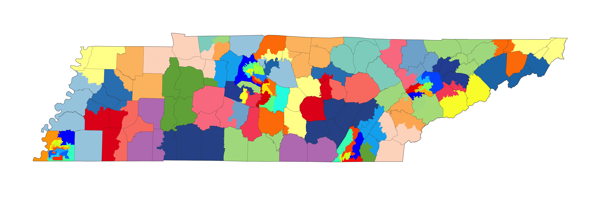
_Note: This plan can be viewed on Dave's Redistricting app:_ https://davesredistricting.org/join/ce99a5c5-8490-4aac-a571-ec20ef00b5eb


```{r, echo=F, message=FALSE, warning=FALSE, include=FALSE, eval=FALSE}
	urban.counties.districts <- read.csv("/Users/user/Google Drive/Projects/Redistricting/2022/TN/Plans/Urban Counties Enacted/TN 2022 House Enacted - Urban counties-district-statistics.csv")
		colnames(urban.counties.districts) <- c("Group.1", "x")


	#Orange Plans
apple.plans <- c(
	"TN_Apple_0_9384",
	"TN_Apple_5_8716",
	"TN_Apple_3_288",
	"TN_Apple_4_32",
	"TN_Apple_2_48")
	
	for (i in 1:length(apple.plans)) {
	plans.tmp <-read.csv(paste0("/Users/user/Google Drive/Projects/Redistricting/2022/TN/Plans/Apple/", apple.plans[i], "-PAF.csv"), colClasses=c("character"))

		colnames(plans.tmp)[1] <- "GEOID"
		length(unique(plans.tmp$District))
	vtd.tmp <- TN_geo.vtd.tmp
	vtd.tmp@data <- dplyr::full_join(vtd.tmp@data, plans.tmp, by= c("GEOID"="GEOID"))
	vtd.tmp@data <- dplyr::left_join(vtd.tmp@data, cols(vtd.tmp@data$District), by="District")
		plan.districts.tmp <- aggregate(vtd.tmp@data$TOTAL, by=list(vtd.tmp@data$District), FUN=sum)
		plan.districts <- rbind.data.frame(plan.districts.tmp, urban.counties.districts[,1:2])
		plan.dev <- (plan.districts[,2]-ideal.house)/ideal.house
			mean(abs(plan.dev))
png(paste0("/Users/user/Library/Mobile Documents/com~apple~CloudDocs/Downloads/", apple.plans[i], ".png"), 
	height = 1000, width = 2000, 
	units = "px", pointsize = 12)
	sp::plot(TN_geo.counties.tmp, col="#c41230", density=10, lwd=5)
	sp::plot(TN_enacted_urban, col=TN_enacted_urban@data$color, border = TN_enacted_urban@data$color, lty=1, lwd = 0.5, add=T)
	sp::plot(vtd.tmp, col = vtd.tmp@data$color, border = vtd.tmp@data$color, lty=1, lwd = 0.5, add=T)
	# plot(district_shp, border="gray50", lwd=1, add=T)
	sp::plot(TN_geo.counties.tmp, border="gray20", lwd=1, add=T)
dev.off()
}
```
```{r, echo=F, message=FALSE, warning=FALSE, include=FALSE, eval=FALSE}
	urban.counties.districts <- read.csv("/Users/user/Google Drive/Projects/Redistricting/2022/TN/Plans/Urban Counties Enacted/TN 2022 House Enacted - Urban counties-district-statistics.csv")
		colnames(urban.counties.districts) <- c("Group.1", "x")


	#Orange Plans
orange.plans <- c(
	"TN_Orange_1_9383",
	"TN_Orange_0_9242",
	"TN_Orange_2_9501",
	"TN_Orange_4_8580",
	"TN_Orange_3_9865")
	
	for (i in 1:length(orange.plans)) {
	plans.tmp <-read.csv(paste0("/Users/user/Google Drive/Projects/Redistricting/2022/TN/Plans/Orange/", orange.plans[i], "-PAF.csv"), colClasses=c("character"))

		colnames(plans.tmp)[1] <- "GEOID"
		length(unique(plans.tmp$District))
	vtd.tmp <- TN_geo.vtd.tmp
	vtd.tmp@data <- dplyr::full_join(vtd.tmp@data, plans.tmp, by= c("GEOID"="GEOID"))
	vtd.tmp@data <- dplyr::left_join(vtd.tmp@data, cols(vtd.tmp@data$District), by="District")
		plan.districts.tmp <- aggregate(vtd.tmp@data$TOTAL, by=list(vtd.tmp@data$District), FUN=sum)
		plan.districts <- rbind.data.frame(plan.districts.tmp, urban.counties.districts[,1:2])
		plan.dev <- (plan.districts[,2]-ideal.house)/ideal.house
			mean(abs(plan.dev))
png(paste0("/Users/user/Library/Mobile Documents/com~apple~CloudDocs/Downloads/", orange.plans[i], ".png"), 
	height = 1000, width = 3000, 
	units = "px", pointsize = 12)
	sp::plot(TN_geo.counties.tmp, col="#c41230", density=10, lwd=5)
	sp::plot(TN_enacted_urban, col=TN_enacted_urban@data$color, border = TN_enacted_urban@data$color, lty=1, lwd = 0.5, add=T)
	sp::plot(vtd.tmp, col = vtd.tmp@data$color, border = vtd.tmp@data$color, lty=1, lwd = 0.5, add=T)
	# plot(district_shp, border="gray50", lwd=1, add=T)
	sp::plot(TN_geo.counties.tmp, border="gray20", lwd=1, add=T)
dev.off()
}
```


## Ensembles

Computer assistance in drawing redistricting plans has greatly enhanced the efficiency of finding alterative redistricting plans. While I have been able to generate a plan that has significantly fewer county splits by hand, I can use a computer algorithm to further investigate questions regarding whether the 2022 enacted plan is consistent with the TN constitution, which prohibits the division of counties except for the purpose of creating legal plans. The computer can simultaneously seek district combinations that limits the number of counties which have districts that span their borders. 

- I employ a Markov chain Monte Carlo algorithm that generates random plans. 

- I instructed the computer to prefer plans that reduce the number of county splits. 

- I ensure that each of the generated plans maintains the overall deviation of under 9.9%. 

- Each plan is built from aggregating contiguous precincts, and the resulting maps are contiguous. 

- The plans I generated are of similar compactness to the enacted plan. 

- I constrained the algorithm to ensure that each plan had a minimum of 1 Black-majority district. There are 12 additional districts within the 5 urban counties, for a total of 13. _Note: All "Apple" plans demostrated here have a Black-majority VAP district of 51.17%. "Orange" plans all have a Black-majority VAP district above 51.35%._

- I used no partisan data in forming plans.

My usage of this algorithm is not for the purpose of making statistical claims nor do I generate a representative sample of all plans. Rather, my use of the algorithm was to generate legally compliant alternatives to the enacted map that are more faithful to the splitting provisions found in the Tennessee constitution.


The plans generated by the ensemble are created using a base precinct geography file. The average population of a precinct is 3,517 persons, ranging from 0 to 18,830. The median precinct has 2,857 persons. The several very large precincts create some contraints for creating possible plans since adding or subtracting a single precinct can cause a district to exceed the allowable deviation, undesirably biasing the creation of plans towards those with more splits. This conceivably indicates that plans with even fewer splits could be generated by aggregating geographies with smaller amounts of people, such as census blocks (mean=39) or block groups (mean=1,515). Moreover, while the average deviation is slightly higher in the ensemble-created plans, had I used block-groups to generate the plans, they would achieve far lower average deviations, since block-groups are significantly smaller and therefore can lead to more precise allocation between districts. Therefore, plans created by the algorithm are conservative demonstrations of possible plans with fewer county splits.

*The plans found in the ensemble have very low numbers of county splits, but fewer splits might be possible.*


For each of the "Apple" plans and the "Orange" plans, I generate 60,000 plans via Markov chain simulation. Starting with the seed plans, I instructed the computer to seek plans that reduce the number of county splits. Of the 60,000 "Apple" plans, none end up with fewer than 26 "TN County Splits". Yet, every single plan generated has fewer county splits, measured in all three ways, than the 2022 enacted House map. For the "Orange" plans, "TN County Splits" range from 28 to 34. With more time, it is possible that "Orange" plans could have been generated with even fewer county splits. In the demonstrative examples below, I only present "Orange" plans that score best on fewer county splits.


### TN_Apple_1_9383 {#fig-0_9384}

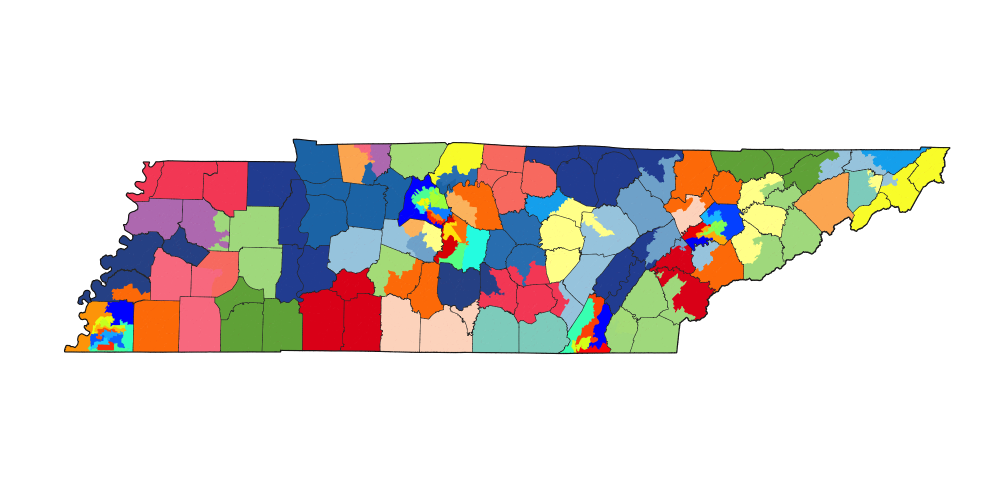
_Note: This plan can be viewed on Dave's Redistricting app:_ "https://davesredistricting.org/join/6f9a71b4-efd5-4a9e-909c-23f953ed4915"

### TN_Apple_5_8716 {#fig-5_8716}

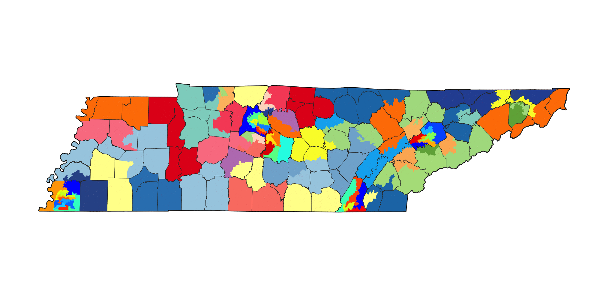
_Note: This plan can be viewed on Dave's Redistricting app:_ "https://davesredistricting.org/join/e0cfac06-160f-4054-adea-997292b7bdde"

### TN_Apple_3_0288 {#fig-3_0288}

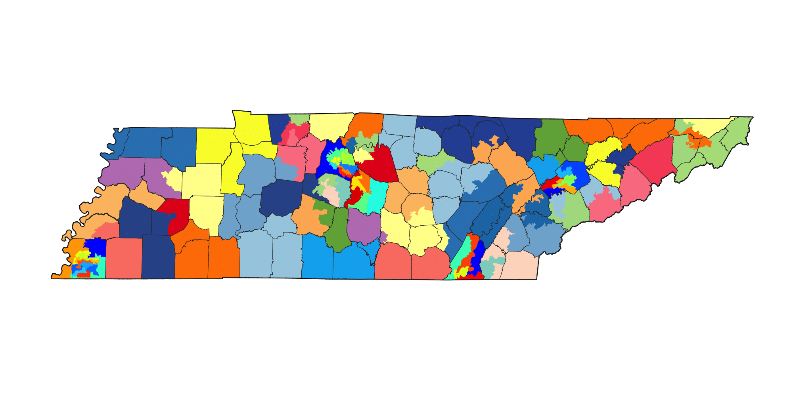
_Note: This plan can be viewed on Dave's Redistricting app:_ "https://davesredistricting.org/join/dbc7dc34-293f-46a1-884e-c591e6f4b0f5"

### TN_Apple_4_0032 {#fig-4_0032}

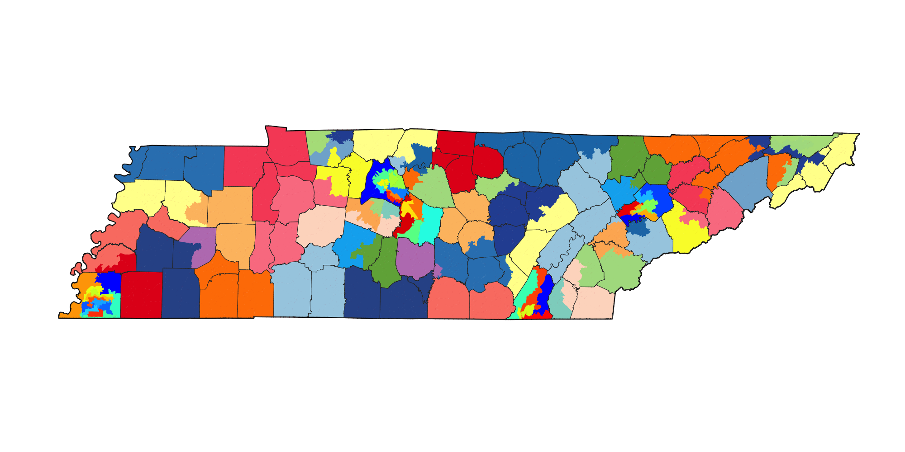
_Note: This plan can be viewed on Dave's Redistricting app:_ "https://davesredistricting.org/join/933667cc-6cc7-42a4-80d6-89cd8ef9fead"

### TN_Apple_2_0048 {#fig-2_0048}

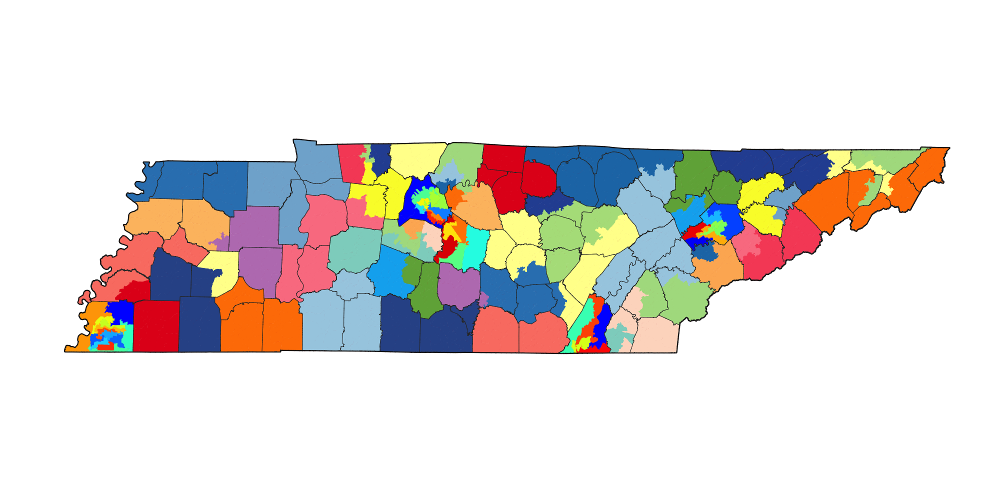
_Note: This plan can be viewed on Dave's Redistricting app:_ "https://davesredistricting.org/join/9188cb2e-9ccc-4fbd-891f-66363b071ad7"


### Table 4 - Ensemble-Generated Plans Descriptive Data {#tab-4}

| PLAN | Counties Split | County Splits | TN County Splits | Overall Deviation | Mean Deviation |
|:---:|:---:|:---:|:---:|:---:|:---:|
| *Apple* |  | | | | |
| 0_9384 | 33 | 71 | 26 | 9.9% | 2.4% |
| 5_8716 | 33 | 71 | 26 | 9.8% | 2.4% |
| 3_0288 | 33 | 71 | 26 | 9.7% | 2.4% |
| 4_0032 | 33 | 71 | 26 | 9.8% | 2.4% |
| 2_0048 | 33 | 71 | 26 | 9.6% | 2.5% |
|  |  |  |  |  |  |
| *Orange* |  |  |  |  |  |
| 1_9383 | 36 | 74 | 28 | 9.9% | 2.5% |
| 0_9242 | 36 | 74 | 28 | 9.9% | 2.5% |
| 2_9501 | 36 | 74 | 28 | 9.9% | 2.6% |
| 4_8580 | 36 | 74 | 28 | 9.9% | 2.6% |
| 3_9865 | 36 | 74 | 28 | 9.9% | 2.6% |

_Note: Each simulated plan has 5 Counties split added since there are five urban counties not simulated. For "Apple" plans, 36 County Splits are added, and for "Orange" plans, 37 County Splits are added. TN County Splits are the same. Overall and Mean deviations are reported for the simulated districts only._


### TN_Orange_1_9383 {#fig-1_9383}

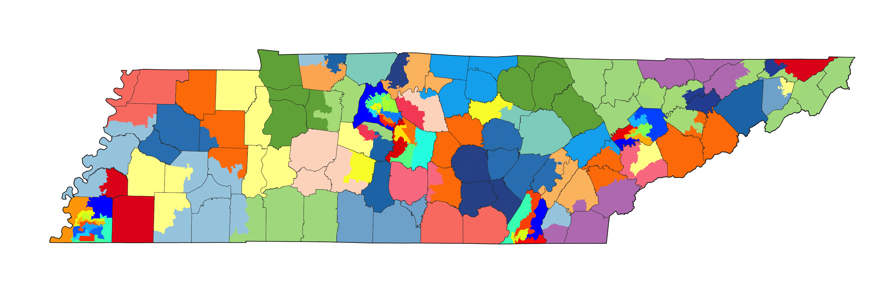
_Note: This plan can be viewed on Dave's Redistricting app:_ "https://davesredistricting.org/join/293c861c-7d95-45bb-a286-e6f273c84a80"

### TN_Orange_0_9242 {#fig-0_9242}

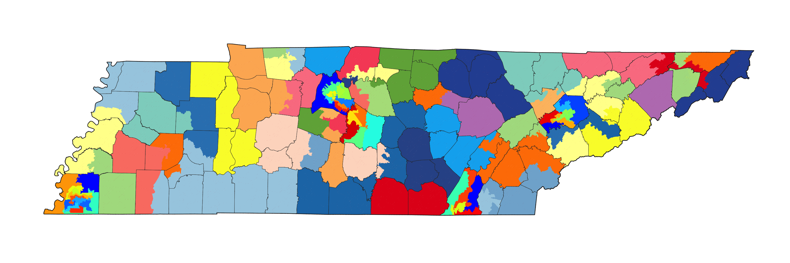
_Note: This plan can be viewed on Dave's Redistricting app:_ "https://davesredistricting.org/join/98020603-aaf6-462a-abcb-20bb5256c13b"

### TN_Orange_2_9501 {#fig-2_9501}

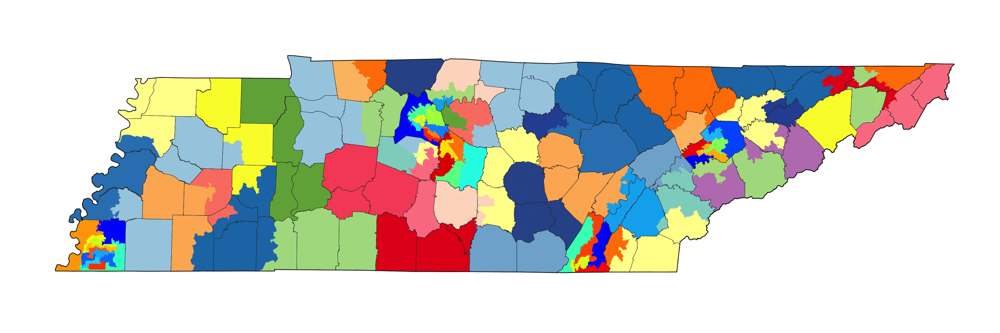
_Note: This plan can be viewed on Dave's Redistricting app:_ "https://davesredistricting.org/join/5bed1874-8eae-4a80-83ac-3a74a9b70e99"

### TN_Orange_4_8580 {#fig-4_8580}

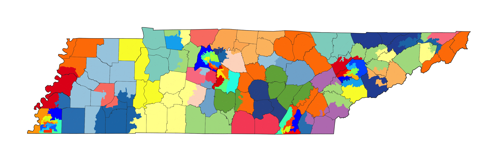
_Note: This plan can be viewed on Dave's Redistricting app:_ "https://davesredistricting.org/join/27015482-1a29-47ff-be98-53513879bbfa"

### TN_Orange_3_9865 {#fig-3_9865}

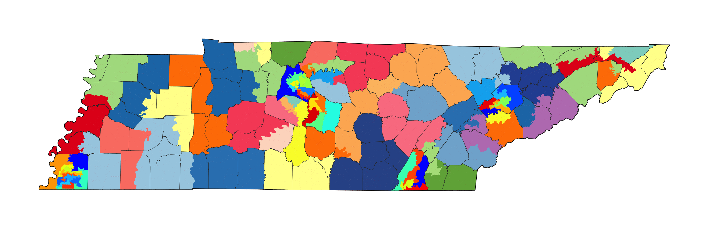
_Note: This plan can be viewed on Dave's Redistricting app:_ "https://davesredistricting.org/join/c6443d06-693e-4f0f-a0a3-889e33291f33"

## Conclusion

Given my experience and expertise in redistricting, it is my conclusion that the number of splits necessary in a Tenneesee House plan after the 2020 census need not exceed 26. This assumes that Shelby County, Davidson County, Knox County, Hamilton County, and Rutherford County are not split except for the internal splits required for equal population. If Shelby County contains 13 districts, I have demonstrated that no more than 26 counties need to be split. If Shelby County contains 14 districts, I have demonstrated that no more than 28 counties need to be split. It is possible that even fewer counties need to be split, but given the time constraints of this report, I have not found a plan that does better. Still, in either the "Apple" or the "Orange" configuration, I have demostrated that the 2022 enacted House map does not minimize the number of counties split.  

For this report, I was asked not to split Shelby County's border. However, I believe that failing to split Shelby County creates population pressures throughout the rest of the state. The effect of not splitting Shelby County is to favor non-urban areas. The choice of not splitting Shelby County has the consequence of increasing the number of county splits in the state. The Democratic House Concept Map demonstrates that as few as 23 counties need to be split, if Shelby County is split once. Splitting Shelby County that way additionally leads to a lower average deviation between districts, since there is a residual population of either 22,000 or 47,500 if Shelby County is not split, _necessitating_ districts to deviate from ideal. Additional research would be needed to determine if my conjecture is correct; that failing to split Shelby County, and potentially other counties, increases the total number of counties affected by splits.

[^1]: Montgomery County is sealed in the 2022 enacted House map, containing three complete districts, all three of which are the three most over-populated in the state. Residents of Montgomery County are significantly underrepresented in the General Assembly. If this county were to have been part of a fourth district, as might be required by law, that would cause at least one additional "TN County Splits" in the plan, increasing it to 31, which is greater than the max allowed in the House Redistricting Guidelines.

[^2]: Sealing a county's border (or "embedding" districts) to avoid a split could have a negative effect on the total number of split counties. For instance, imagine a county is sealed in but in doing so a total of 20,000 extra people are placed in districts in that county. If an adjacent county has a population that is the ideal minus 20,000, it will now have to split an adjacent county to get the population it could have otherwise had from the first county. Like the butterfly effect, it could ripple through the plan. Additionally, if sealing in a county prohibits a more efficient split for another county, it could have the effect of increasing the total county splits in a plan. Moreover, as with Unicoi, the effect of sealing Washington County is that it is _guaranteed_ that Carter County is split, even though its population is small enough to not be split.

[^3]: Plan comparison documents found on the General Assembly website (https://www.capitol.tn.gov/Archives/House/112GA/redistricting/Documents/additional%20december%20evaluations.pdf) list county splits as 30 for the 2022 enacted plan, and 23 for the House Democratic concept map. The split count used by the General Assembly is not reported in either Maptitude for Redistricting (to which I have a license) or Dave's Redistricting App. This is a non-standard way of defining county splits and if applied as a legal standard might lead to a situation where larger counties are needlessly penalized since there is more discretion as to whether it needs to be split (see discussion above about Shelby County).


