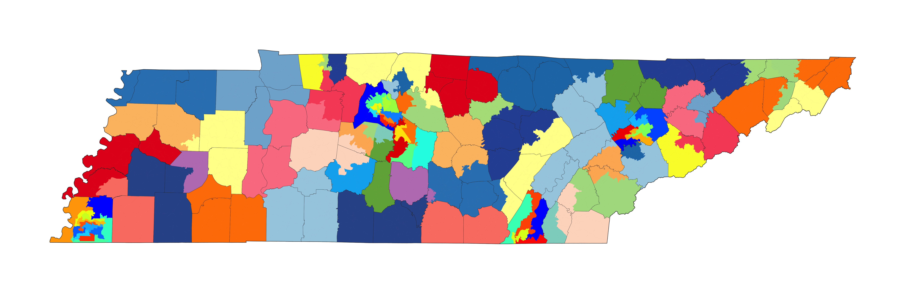
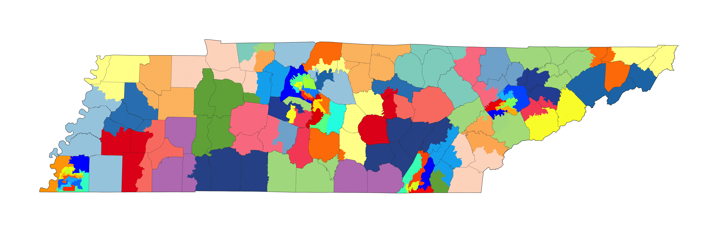

Failing to split Shelby County creates population pressures throughout the rest of the state. The effect of not splitting Shelby County is to favor non-urban areas.

Counsel has asked me to prepare a report after creating demostrative plans adhering to the following criteria:

1. Shelby County should have exactly 13 or 14 house districts.  No portion of Shelby County should be combined with any adjacent county in creating a district.

2. All 13 majority-minority districts created in the Redistricting Plan enacted by the Tennessee legislature should be preserved in your maps.

3. Davidson, Hamilton, and Knox Counties, like Shelby County, should not have any portions of the county combined with any adjacent counties in creating a district.

In addition to the four counties listed above, I also restricted Rutherford County to have 5 complete districts without combining any district to an adjacent county.

Plaintiffs ask that I create these maps with a goal of maintaining a maximum overall population deviation of 9.90% or less. A second goal is to creates as few county-dividing districts as possible. 

Plaintiffs asked that I create demonstrative maps to be appended to this expert report as examples of maps that meet the three enumerated goals stated above but that also have fewer than 30 county-dividing districts and lower than a 9.90% total population deviation.


The five counties listed above have districts completely "embedded" in them. The rest of the state can be drawn independently of these counties. Below is a summary of the 5 counties which will be treated as they were enacted in the 2022 House map:

- Shelby County with exactly 13 or 14 districts

- Davidson County with exactly 10 districts

- Knox County has exactly 7 districts

- Hamilton County has exactly 5 districts

- Rutherford County has exactly 5 districts

```{r, echo=F, message=FALSE, warning=FALSE, include=FALSE, eval=FALSE}
# TN_geo.blocks <- rgdal::readOGR("/Users/user/Google Drive/GitHub/Data Files/GIS/Tigerline/2020/blocks/47/tl_2020_47_tabblock20.shp")
# 	TN_geo.blocks.tmp <- TN_geo.blocks
# TN_pop.blocks <- read.csv("/Users/user/Google Drive/GitHub/Data Files/Census/TN2020.pl/clean data/TN_blocks.csv")
# 	TN_pop.blocks$GEOCODE <- as.character(TN_pop.blocks$GEOCODE)
# TN_geo.blocks.tmp@data <- dplyr::full_join(TN_geo.blocks.tmp@data, TN_pop.blocks, by= c("GEOID20"="GEOCODE"))
# tn_enacted_block <- read.csv("/Users/user/Google Drive/Projects/Redistricting/2022/TN/Plans/2022 Enacted/TN 2022 House Enacted-block-assignments.csv")
source("https://raw.githubusercontent.com/jcervas/R-Functions/main/GERRYfunctions.R")

TN_pop.counties <- read.csv("/Users/user/Google Drive/GitHub/Data Files/Census/TN2020.pl/clean data/TN_county.csv")
tn.pop <- sum(TN_pop.counties$TOTAL)
ideal.house <- tn.pop/99

4078548/ideal.house

929744/ideal.house
715884/ideal.house
478971/ideal.house
366207/ideal.house
341486/ideal.house
tn.pop - (929744+715884+478971+366207+341486)
4078548/ideal.house

deviation <- 0.0143375

freeze.dist <- 
	c(
		"Shelby County",
		"Davidson County",
		"Rutherford County",
		"Hamilton County",
		"Knox County"
		)
plans <- c("apple_seed", "orange_seed")
exc.cnty <- TN_pop.counties$GEOCODE[TN_pop.counties$NAME %in% freeze.dist]
TN.vtd <- rgdal::readOGR("/Users/user/Google Drive/GitHub/Data Files/Census/TN2020.pl/GIS/vtd/TN_vtd20.shp")
	TN.vtd <- TN.vtd[!paste0("47", TN.vtd@data$COUNT) %in% exc.cnty, ]
rgdal::writeOGR(TN.vtd, "/Users/user/Library/Mobile Documents/com~apple~CloudDocs/Downloads/", layer= "short-TN-vtd", driver="ESRI Shapefile", overwrite_layer=T)


apple_seed <- read.csv("/Users/user/Google Drive/Projects/Redistricting/2022/TN/Plans/Apple Seed/short - apple-seed-precinct-assignments.csv", colClasses=c("character"))
orange_seed <- read.csv("/Users/user/Google Drive/Projects/Redistricting/2022/TN/Plans/Orange Seed/short - orange-seed - precinct-assignments.csv", colClasses=c("character"))

plans.tmp <- orange_seed
```


*[Table 1](#tab-1)* shows the population of the 5 urban counties that are not changed from the plan that was enacted.


### Table 1 - Counties which are not split - Shelby County has 13 districts {#tab-1}

| County | Population | Ideal Districts | Districts in enacted |
|:---:|:---:|:---:|:---:|
| Shelby County | 929,744 | 13.32 | 13 |
| Davidson County | 715,884 | 10.26 | 10 |
| Knox County | 478,971 | 6.86 | 7 |
| Hamilton County | 366,207 | 5.25 | 5 |
| Rutherford County | 341,486 | 4.89 | 5 |
|---|---|---|---|
| *Total* | *2,832,292* | *40.47* | *40* |
| *90 other counties* | *4,078,548* | *58.43* | *58* |
_Note: 2020 Census total population. The ideal size of one House district is 69,806. These five counties have a total population of 2,832,292. Taken together, they ideally contain 40.57 seats out of 99 (40.1%) total seats. In the enacted plan, they only have 40 total districts. Tennessee's total state population is 6,910,840._


### Counties with populations sufficient for one or more whole districts

The following provides a summary of which counties contain populations greater than the size of a single House districts:

1) Two counties have populations sufficent for exactly one district; Greene and Robertson counties. 

2) Six additional counties have populations that exceed the size of one House district but not quite sizable for two districts, and thus will need to be split once (Bradley, Maury, Madison, Sevier, Putnam, Anderson). 

3) Washington and Blount counties have populations can allow them to contain two complete House districts. 

4) Sumner, Sullivan, and Wilson counties all may have two full districts and extend a third into another county. 

5) Williamson and Montgomery[^a] counties all have three full House districts and a part of a fourth. 
[^a]: Montgomery County is sealed in the 2022 enacted House map, containing three complete districts, all three of which are the three most over-populated in the state. Residents of Montgomery County are significantly underrepresented in the General Assembly. If this county were to have part of a fourth district, as might be required by law, that would cause at least one additional "TN County Splits" in the plan, increasing it to 31, which is greater than the max allowed in the House Redistricting Guidelines.

6) Hamilton and Rutherford counties both can fully contain 5 districts each. 

7) Knox County can have 7 whole districts. 

8) Davidson County can have 10 full districts. 

9) Shelby can support either 13 or 14 full districts.

* Unicoi County is only adjacent to Carter if Greene and Washington Counties are "sealed". It can only form a district with part Carter unless Washington County is split (but then Carter County does not need be split).


Any county that is large enough to contain a least one district wholly need not be split. That does not imply it *will not* be split, however. But, the total number of splits is necessarily less than the total number of districts (99) by the fact districts have a smaller number of people than that of several whole counties. Of course, some counties will be split in order to achieve population equality. We can calculate the upper bound on the number of counties that need be split[^1].

Let us assume that any county that has a population multiple that is an integer of a district is not split. For Shelby, that is either 13 or 14. Fourty-seven such districts can be draw in Tennessee across 9 counties (Shelby, Davidson, Knox, Hamilton, Rutherford, Blount, Washington, Robertson, Greene). So far, that implies that 47 out of the total 99 districts can be drawn to not cut a single county line (This does not include Montgomery County; if included, that implies 50 out of 99 can be drawn without a single "TN County Split") 

If one were to draw the other 52 districts to exactly equal population, n-1 county splits would be necessary. So, to complete a 99-district plan where the nine counties listed above were drawn with the districts full contained within their boundaries, and each other district contained exactly its share of the remaining population, there would be 51 counties cut. This is the maximum conceivable number. In reality, because map-drawers are granted permission to deviate from the ideal population, significant reductions to this number can be made. 

The minimum number of counties that need be split cannot be found analytically, but computers can be instructed to develop plans that limit the splitting of counties. Later in this report, I will show that tens of thousands of plans made from combining precincts result in fewer "TN County Splits" than the 2022 enacted House plan.

Measuring plans using these three different notions allow for comparisons any plan equally. *[Table 2](#tab-2)* does this for the 2012-2020 enacted map, the 2022-2030 enacted map, and the House Democratic Concept map. The 2022 enacted map scores the worst across all three measures.

In the plan that was enacted in 2012 and used in subsequent elections until 2020, 36 total counties are split into more than one district. These 36 counties were split 70 times in total. 28 counties have districts that have their boundary split. In the 2022 enacted House plan, 38 of the 95 counties are divided into at least two districts, for a total of 74 times, and 30 counties have districts that span the border. By comparison, the conceptual map proposed by the House Democrats cuts only 29 of the 95 counties, and does so by dividing counties only 67 times[^2]. Note that 18 counties exceed the district population and therefore *must* be divided. More restrictive population deviation standards would mean a trade-off that would induce an increasing the number of county splits. The overall deviation, and average absolute deviation are shown for each of the plans in *[Table 2](#tab-2)*.

For the map enacted to be used after the 2022 elections, 2 additional counties were cut, and a total of 4 more cuts, and two additional counties have districts that span their borders compared to the 2012 enacted map. The Democratic House conceptual map splits 9 fewer counties, and does so 7 fewer times. I have 7 fewer counties where a district spans it border to complete a district. 


#### 2022 Enacted Plan

The plan that was enacted by the General Assembly (2022 enacted plan) for use between 2022 and 2030 has an overall deviation of 9.91%. Districts vary in population between the smallest, House District 78, which has a total population of 66,445 (-4.82%), and the two with the largest populations, House District 67 and 68, both of which have a total population of 73,358 (+5.09%). 

Thirteen districts are kept completely contained in Shelby County. The county is split 12 times into 13 pieces, but the county border itself is not split. Davidson County contains 10 districts fully inside the county boundaries, but the county line itself is unsplit. Knox County contains 7 districts fully within the county boundary, and the county border itself is not split. Hamilton contains exactly 5 districts and the county boundary is not cut. Rutherford County wholly contains 5 districts, with the county border not crossed. It appears that the drafters of the map intended to "seal in" these more urban counties in a way to avoid the splitting of their borders. One consequence of this choice is that there is a shortage in population of over 40,000 people that need to be absorbed by the remaining 59 districts not included in these 40, which may actually *increase* to total number of counties that need to be split. Moreover, restricting Shelby County to just 13 districts, instead of the potential 14 districts, almost certainly leads to one additional split at some place in the statewide map; this is because there will only be 85 instead of 86 remaining districts.


### Figure 4 - 2022 Enacted Plan {#fig-enacted}


#### House Democratic Concept Map 12/15/2021

An alternative map was proposed by the House Democrats on December 15, 2021. The map has an overall deviation of 9.72%. Concept District 7 has the smallest population of 66,495 (-4.74%). Concept District 27 has the largest population of 73,280 (+4.98%). Thirteen districts are wholly contained in Shelby County, and one district (94) also contains all of Fayette County. This means that Shelby County is split on the county border, but the average deviation of districts in Shelby County are lower. Like the 2022 enacted map, the alternative proposed by the House Democrats creates 10 districts in Davidson County, with no county split. Likewise, Know County contains 7 districts with no county split, Hamilton contains 5 districts with no county split, and Rutherford contains 5 counties with no split.


### Figure 5 - House Democratic Concept Map {#fig-housedem}

*Note, for the plans generated by the ensemble, the district numbers do not align closely with plans drafted by hand.*


### Table 2 - Total County Splits by Plan {#tab-2}

| PLAN | Counties Split | County Splits | TN County Splits | Overall Deviation | Mean Deviation |
|:---:|:---:|:---:|:---:|:---:|:---:|
| 2012 Enacted | 36 | 70 | 28 | 9.7% | 3.4% |
| 2022 Enacted | 38 | 74 | 30 | 9.9% | 3.3% |
| House Democratic Concept | 29 | 67 | 23 | 9.7% | 2.2% |
_Note: "Counties Split" is the total number of counties that has at least two districts in it. "County Splits" is the total number of pieces in counties. "TN County Splits" is the number of counties that the county line needed to be crossed to form a complete district with an adjacent county._


| PLAN | Counties Split | County Splits | TN County Splits | Overall Deviation | Mean Deviation |
|:---:|:---:|:---:|:---:|:---:|:---:|
| Apple Seed | 33 | 65 | 26 |
| Orange Seed | 41 | 74 | 34 |

## Seed Plans

Using the perimeters described above, I created two seed plans in Dave's Redistricting App. The plans are generated using only the 90 non-urban counties (excluding Shelby, Davidson, Knox, Hamilton, and Rutherford counties). In the first plan, I drew 59 districts. These plans assume that Shelby County contains 13 districts. They will be given the code word "Apple" as I refer to them throughout this report. In the second plan, I drew 58 districts. In this plan, Shelby County has 14 districts. Plans of this nature will be referred to as "Orange". These plans both adhere to what I call the "n-1" rule, meaning no county is split unless necessary for population deviation. I used no racial information, nor did I use any partisan information. Though no effort like this can guarentee compliance with the Voting Rights Act, the court record indicates that 9 VRA compliant districts are found in Shelby County, 2 in Davidson County, and 1 in Hamilton County, which are perserved. One addtional VRA district spans Hardeman, Madison, and Haywood counties; For this district, I ensure that it contains a Black voting age population of at least 52%, which can be achieved without splitting either Hardeman or Haywood counties (which have a combined population of 43,326).


## Ensembles

Computer assistance in drawing redistricting plans has greatly enhanced the efficiency of finding alterative redistricting plans. While I have been able to generate plans that have significantly fewer county splits by hand, I can use a computer algorithm to further investigate the question about whether the 2022 enacted plan, consistent with the TN constitution that prohibits the division of counties except for the purpose of creating legal plans, limits the number of counties which have districts that span their borders. 

- I employ a Markov chain Monte Carlo algorithm that generates random plans. 

- I instructed the computer to perfer plans that reduce the number of county splits. 

- I ensure that each of the generated plans maintains the overall deviation of under 9.9%. 

- Each plan is built from aggregating contiguous precincts, and the resulting maps are contiguous. 

- The plans I generated are of similar compactness to the enacted plan. 

- I constrained the algorithm to ensure that each plan had a minimum of 13 Black-majority districts. 

- I used no partisan data in forming plans.

My usage of this algorithm is not for the purpose of making statistical claims nor do I generate a representative sample of all plans. Rather, my use of the algorithm was to generate legally compliant alternatives to the enacted map that are more faithful to the splitting provisions found in the Tennessee constitution.


The plans generated by the ensemble are created using a base precinct geography file. The average population of a precinct is 3,517 persons, ranging from 0 to 18,830. The median precinct has 2,857 persons. The several very large precincts such as the largest limit the potential for some plans to be generated, undesirably biasing the creating of plans with more splits. This conceivably indicates that even fewer "TN County Splits" could be generated if aggregating geographies with smaller amounts of people, such as census blocks (mean=39) or block groups (mean=1,515). Moreover, while the average deviation is slightly higher in the ensemble-created plans, had I used block-groups to generate the plans, they would achieve far lower average deviations, since block-groups are significantly smaller and therefore can lead to more precise allocation between districts. Therefore, plans created by the algorithm are conservative demonstrations of possible plans with fewer county splits.

*The plans found in the ensemble have very low numbers of county splits, but fewer splits might be possible.*


## "Apple" Plans

"Apple" plans are 59 district House plans in the 90 non-urban counties containing 4,078,548 people. These districts would average 69,127.93, which is -678.5 fewer than what is ideal.

### Apple Seed

I have created a seed "Apple" plan that creates 59 districts in the 90 non-urban counties described above.


### Figure 1 - Apple seed plan {#fig-1}

_Note: This plan can be viewed on Dave's Redistricting app:_ https://davesredistricting.org/join/664172f4-dab0-4114-aca3-111879cd2e17


## "Orange" Plans

"Orange" plans are 58 district House plans in the 90 non-urban counties containing 4,078,548 people. These districts would average 70,319.79, which is 513.33 more than what is ideal.

### Orange Seed


### Figure 2 - Orange seed plan {#fig-2}

_Note: This plan can be viewed on Dave's Redistricting app:_ https://davesredistricting.org/join/ce99a5c5-8490-4aac-a571-ec20ef00b5eb


Conjecture: The choice of not splitting Shelby County has the consequence of increasing the number of county splits in the state


| PLAN | Counties Split | County Splits | TN County Splits | Overall Deviation | Mean Deviation |
|:---:|:---:|:---:|:---:|:---:|:---:|
| Apple |  | | | | |
| 19384 | 36 | 
| Orange | 36 | 50 | 28 | | |

_Note: Each simulated plan has 5 Counties split added, along with 36 County Splits. This adjusts for the splits in the 5 urban counties._


[^1]: Sealing in a county could have a negative effect on the number of split counties. For instance, imagine a county is sealed in but in doing so a total of 20,000 extra people are placed in districts in that county. If an adjacent county has a population that is the ideal minus 20,000, it will now have to split an adjacent county to get the population it could have otherwise had from the first county. Like the butterfly effect, it could ripple through the plan. Additionally, if sealing in a county prohibits a more efficient split for another county, it could have the effect of increasing the total county splits in a plan. Moreover, as with Unicoi, the effect of sealing Washington County is that is _guaranteed_ that Carter County is split, even though its population is small enough to not be split.

[^2]: Plan comparison documents found on the General Assembly website (https://www.capitol.tn.gov/Archives/House/112GA/redistricting/Documents/additional%20december%20evaluations.pdf) list county splits as 30 for the 2022 enacted plan, and 23 for the House Democratic concept map. I do not know how these measures are calculated, nor are they reported in either Maptitude for Redistricting (which I have a license) or Dave's Redistricting App. One potential explanation of this measure of splitting is the number of districts that crosses into multiple counties. This is a non-standard way of defining county splits and if applied as a legal standard might lead to a situation where larger counties are needlessly penalized since there is more discretion as to whether it needs to be split. (see discussion above about Shelby County)


